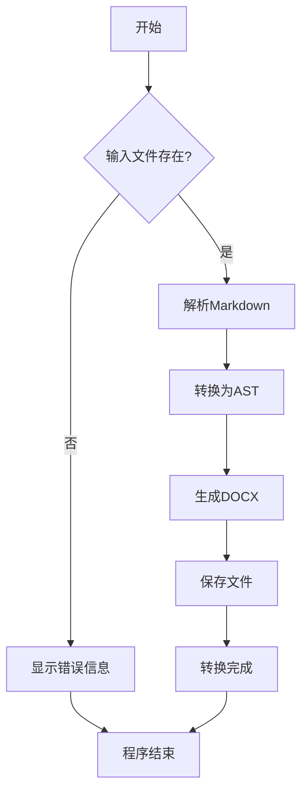
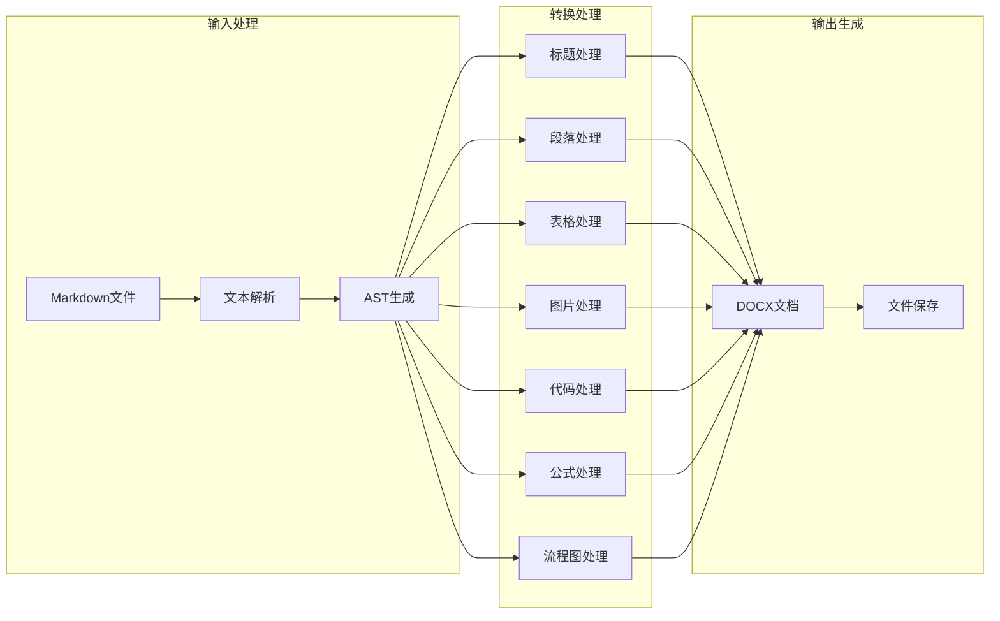
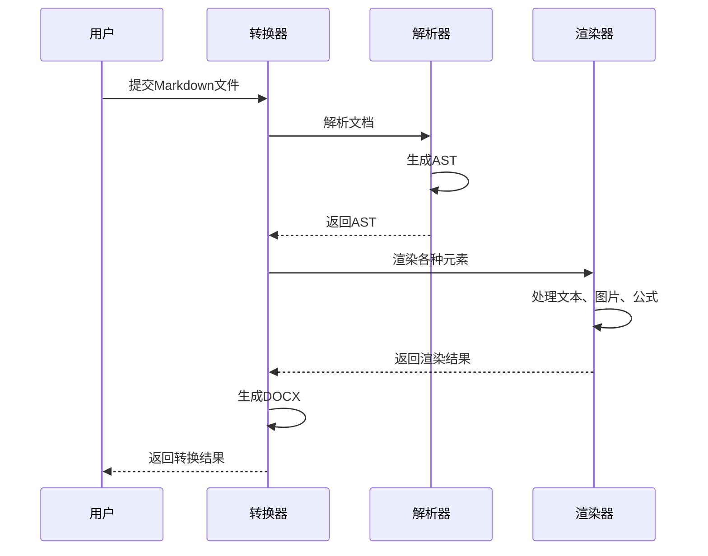
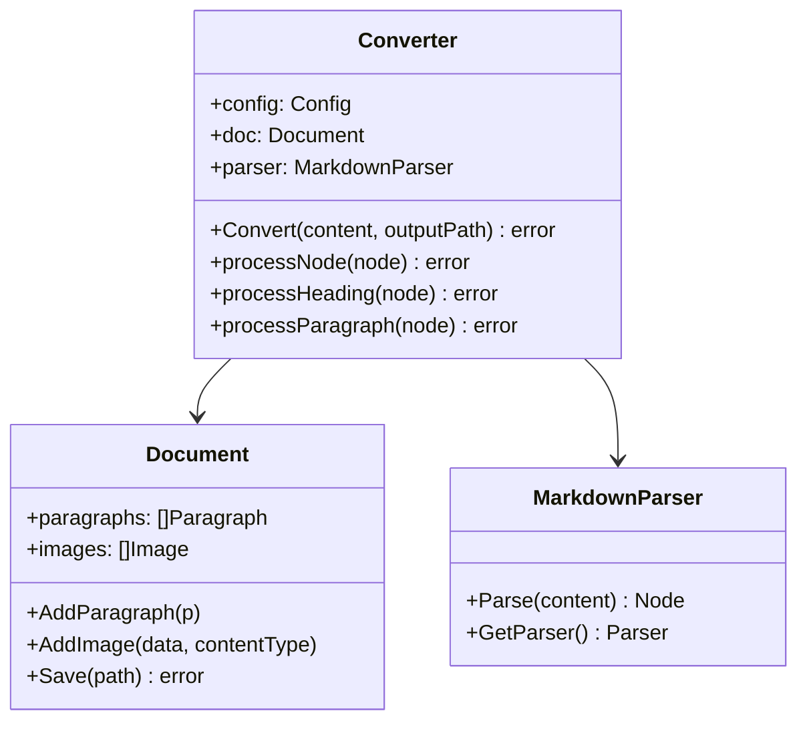

# md2word 综合功能测试

这是一个综合性的Markdown转DOCX测试文档，用于验证md2word工具的所有功能特性。

---

## **1.1 自动编号标题测试**

本节测试自动编号功能，标题会在Word中显示为可编辑的自动编号。

### **1.1.1 基础编号功能**

这是1.1.1节的内容，测试三级编号。

#### **1.1.1.1 详细功能说明**

这是1.1.1.1节的详细说明，测试四级编号。

### **1.1.2 编号格式支持**

支持多种编号格式：
- 二级标题：`## **1.1 标题**`
- 三级标题：`### **1.1.1 标题**`
- 四级标题：`#### **1.1.1.1 标题**`

## **1.2 新编号序列开始**

这里开始新的编号序列，从1.2开始。

---

## 基础格式测试

### 文本格式

本段落包含各种文本格式：**粗体文本**、*斜体文本*、~~删除线文本~~、`行内代码`。

### 标题层级

#### 四级标题
##### 五级标题
###### 六级标题

---

## 列表功能测试

### 无序列表

- 第一项内容
- 第二项内容
  - 嵌套子项 2.1
  - 嵌套子项 2.2
    - 更深层嵌套 2.2.1
- 第三项内容

### 有序列表

1. 第一步：环境准备
2. 第二步：安装依赖
3. 第三步：配置参数
   1. 子步骤 3.1
   2. 子步骤 3.2
4. 第四步：运行测试

---

## 表格功能测试

| 功能模块 | 状态 | 优先级 | 说明 |
|:---------|:----:|:------:|-----:|
| 标题转换 | ✅ 完成 | 高 | 支持1-9级标题 |
| 自动编号 | ✅ 完成 | 高 | 支持Word自动编号 |
| 表格转换 | ✅ 完成 | 中 | 支持带边框表格 |
| 图片处理 | ✅ 完成 | 中 | 自动缩放和优化 |
| 代码高亮 | ✅ 完成 | 中 | 多语言语法高亮 |
| 数学公式 | ✅ 完成 | 低 | MathJax渲染 |
| 流程图 | ✅ 完成 | 低 | Mermaid图表 |

---

## 代码块测试

### Python代码

```python
def convert_markdown_to_docx(input_file, output_file):
    """
    将Markdown文件转换为DOCX格式
    """
    with open(input_file, 'r', encoding='utf-8') as f:
        content = f.read()
    
    # 解析Markdown
    parser = MarkdownParser()
    ast = parser.parse(content)
    
    # 转换为DOCX
    converter = DocxConverter()
    converter.convert(ast, output_file)
    
    print(f"转换完成: {input_file} -> {output_file}")
```

### Go代码

```go
package main

import (
    "fmt"
    "log"
    "os"
)

func main() {
    if len(os.Args) < 3 {
        log.Fatal("用法: md2word <输入文件> <输出文件>")
    }
    
    inputFile := os.Args[1]
    outputFile := os.Args[2]
    
    converter := NewConverter()
    if err := converter.Convert(inputFile, outputFile); err != nil {
        log.Fatalf("转换失败: %v", err)
    }
    
    fmt.Printf("转换成功: %s -> %s\n", inputFile, outputFile)
}
```

---

## 数学公式测试

### 行内公式测试

这是一个简单的行内公式：$E = mc^2$

圆的面积公式为 $A = \pi r^2$。

二次方程的判别式：$\Delta = b^2 - 4ac$

当 $x > 0$ 时，函数 $f(x) = \sqrt{x}$ 有定义。

积分公式：$\int_0^1 x^2 dx = \frac{1}{3}$

较长的行内公式：$x = \frac{-b \pm \sqrt{b^2 - 4ac}}{2a}$

### 块级公式测试

高斯积分：

```math
\int_{-\infty}^{\infty} e^{-x^2} dx = \sqrt{\pi}
```

二次方程求根公式：

```math
x = \frac{-b \pm \sqrt{b^2 - 4ac}}{2a}
```

矩阵表示：

```math
\begin{pmatrix}
a & b \\
c & d
\end{pmatrix}
\begin{pmatrix}
x \\
y
\end{pmatrix}
=
\begin{pmatrix}
ax + by \\
cx + dy
\end{pmatrix}
```

复杂矩阵方程：

```math
\begin{pmatrix}
a_{11} & a_{12} & a_{13} \\
a_{21} & a_{22} & a_{23} \\
a_{31} & a_{32} & a_{33}
\end{pmatrix}
\begin{pmatrix}
x_1 \\
x_2 \\
x_3
\end{pmatrix}
=
\begin{pmatrix}
b_1 \\
b_2 \\
b_3
\end{pmatrix}
```

分段函数：

```math
f(x) = \begin{cases}
x^2 & \text{if } x \geq 0 \\
-x^2 & \text{if } x < 0
\end{cases}
```

### 混合测试

在方程 $ax^2 + bx + c = 0$ 中，当判别式 $\Delta = b^2 - 4ac > 0$ 时，方程有两个不同的实根：

```math
x_1 = \frac{-b + \sqrt{\Delta}}{2a}, \quad x_2 = \frac{-b - \sqrt{\Delta}}{2a}
```

这就是著名的求根公式。

---

## 流程图测试

### 基础流程图



### 复杂流程图



### 时序图测试



### 类图测试



---

## 图片测试

### 小图片测试

这是一个小图标，应该保持原始尺寸：


### 大图片测试

这是一个大图片，应该自动缩放以适应页面宽度：


---

## 引用和分隔线测试

### 单行引用

> 这是一段引用文字，用于测试引用格式的转换效果。

### 多行引用

> 这是多行引用的第一行内容。
> 
> 这是第二行内容，中间有空行。
> 
> 最后一行引用内容。

---

## 链接测试

### 基础链接

这是一个指向[GitHub](https://github.com)的链接。

### 带标题的链接

访问[md2word项目](https://github.com/example/md2word "md2word - Markdown to Word converter")了解更多信息。

### 自动链接

直接访问 https://example.com 或发送邮件到 test@example.com。

---

## 特殊字符测试

### 中文标点符号

测试中文标点符号：，。；：？！""''（）【】《》

### 英文标点符号

测试英文标点符号：,.;:?!"'()[]<>

### 特殊符号

测试特殊符号：@#$%^&*+-=_|\\`~

### Unicode字符

测试Unicode字符：★☆♠♣♥♦→←↑↓

---

## 总结

本文档包含了md2word工具的所有主要功能测试：

1. ✅ **自动编号标题** - 支持多级编号和智能分组
2. ✅ **基础格式** - 粗体、斜体、删除线、行内代码
3. ✅ **列表功能** - 有序和无序列表，支持嵌套
4. ✅ **表格转换** - 支持复杂表格和对齐方式
5. ✅ **代码高亮** - 多语言语法高亮支持
6. ✅ **数学公式** - 行内和块级公式渲染，智能尺寸适配
7. ✅ **流程图** - Mermaid图表转换，高清渲染
8. ✅ **图片处理** - 自动缩放和尺寸优化
9. ✅ **链接转换** - 超链接和自动链接
10. ✅ **引用格式** - 单行和多行引用
11. ✅ **特殊字符** - 各种字符和符号支持

**测试完成时间：** 2024年12月

**工具版本：** md2word v1.0

---

*本文档由md2word工具生成，用于验证转换功能的完整性和准确性。*