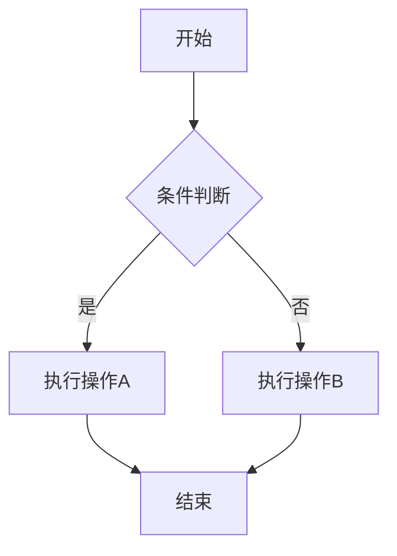

# 测试文档

这是一个Markdown转DOCX的测试文档，用于验证各种格式的转换效果。

## 二级标题

这是正文内容，使用宋体五号字体。

### 三级标题

本段落包含各种格式：**粗体**、*斜体*、~~删除线~~、`行内代码`。

#### 四级标题

##### 五级标题

###### 六级标题

## 列表测试

### 无序列表

- 项目一
- 项目二
  - 子项目2.1
  - 子项目2.2
- 项目三


### 有序列表

1. 第一步
2. 第二步
3. 第三步

## 表格测试

| 姓名 | 年龄 | 城市 |
|:-----|:----:|-----:|
| 张三 | 25 | 北京 |
| 李四 | 30 | 上海 |
| 王五 | 28 | 广州 |

## 代码块测试

```python
def hello_world():
    print("Hello, World!")
    return True
```

```go
package main

import "fmt"

func main() {
    fmt.Println("Hello, Go!")
}
```

## 引用测试

> 这是一段引用文字。
> 可以包含多行内容。

## 分隔线

---

## 链接和图片

这是一个[链接](https://example.com)。

## 数学公式测试

行内公式：当 $E = mc^2$ 时，能量与质量成正比。

块级公式：

```math
\int_{-\infty}^{\infty} e^{-x^2} dx = \sqrt{\pi}
```

## 流程图测试



## 图片优化测试

### 1. 小图标 (100x100)
应保持原始尺寸，不拉伸。


### 2. 大图表 (1200x800)
应自动缩放以适应页面宽度，保持清晰度。


## 复杂表格

| 功能 | 状态 | 说明 |
|------|------|------|
| 标题转换 | ✅ 完成 | 支持1-9级标题 |
| 表格转换 | ✅ 完成 | 支持带边框表格 |
| 图片转换 | ✅ 完成 | 支持本地和网络图片 |
| 公式转换 | ✅ 完成 | 使用MathJax渲染 |
| 流程图 | ✅ 完成 | 使用Mermaid CLI |

---

**文档结束**
