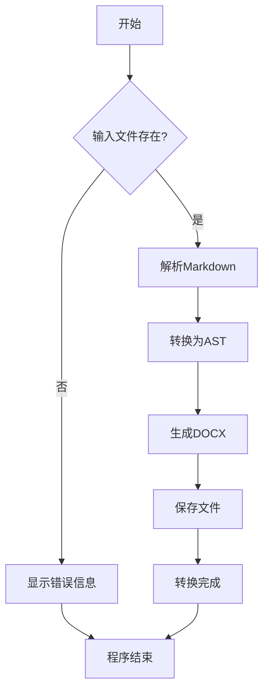
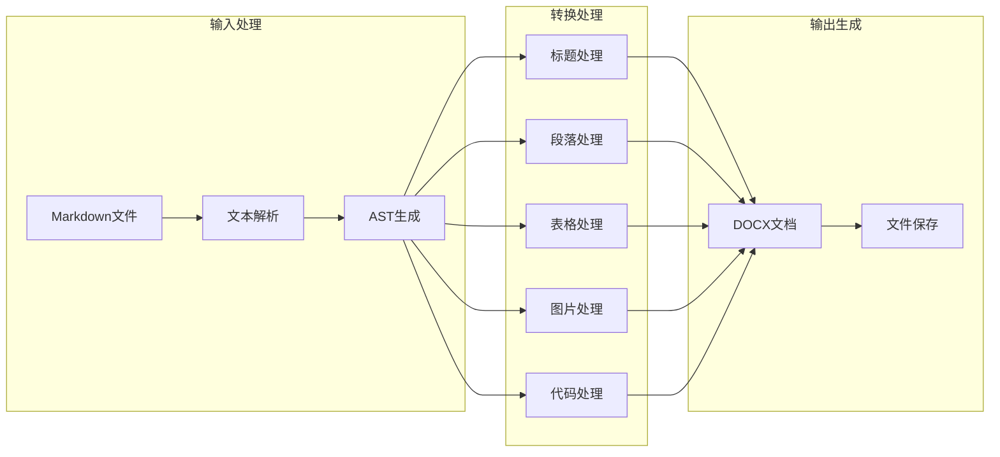
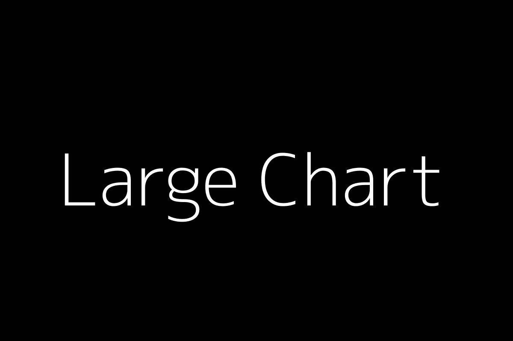

# md2word 完整功能测试文档

这是一个综合性的Markdown转DOCX测试文档，用于验证md2word工具的所有功能特性。

---

## **1.1 自动编号标题测试**

本节测试自动编号功能，标题会在Word中显示为可编辑的自动编号。

### **1.1.1 基础编号功能**

这是1.1.1节的内容，测试三级编号。

#### **1.1.1.1 详细功能说明**

这是1.1.1.1节的详细说明，测试四级编号。

#### **1.1.1.2 实现原理**

编号解析和Word自动编号生成的实现原理。

### **1.1.2 编号格式支持**

支持多种编号格式：
- 二级标题：`## **1.1 标题**`
- 三级标题：`### **1.1.1 标题**`
- 四级标题：`#### **1.1.1.1 标题**`

## **1.2 编号分组测试**

测试相同顶级编号的分组功能。

### **1.2.1 分组规则**

相同数字开头的编号会被分为一组，使用同一个Word编号实例。

## **2.1 新编号序列开始**

这里开始新的编号序列，从2.1开始。

### **2.1.1 系统架构设计**

系统整体架构的设计说明。

#### **2.1.1.1 前端架构**

前端技术栈和架构设计。

#### **2.1.1.2 后端架构**

后端服务和数据处理架构。

### **2.1.2 数据库设计**

数据库表结构和关系设计。

## **2.2 功能模块划分**

各个功能模块的详细说明。

## **5.1 跳跃编号测试**

测试跳跃编号功能，从5.1开始，跳过了3和4。

### **5.1.1 跳跃编号原理**

Word自动编号支持任意起始值设置。

---

## 基础格式测试

### 文本格式

本段落包含各种文本格式：**粗体文本**、*斜体文本*、~~删除线文本~~、`行内代码`。

### 标题层级

#### 四级标题
##### 五级标题
###### 六级标题

---

## 列表功能测试

### 无序列表

- 第一项内容
- 第二项内容
  - 嵌套子项 2.1
  - 嵌套子项 2.2
    - 更深层嵌套 2.2.1
- 第三项内容

### 有序列表

1. 第一步：环境准备
2. 第二步：安装依赖
3. 第三步：配置参数
   1. 子步骤 3.1
   2. 子步骤 3.2
4. 第四步：运行测试

---

## 表格功能测试

### 基础表格

| 功能模块 | 状态 | 优先级 | 说明 |
|:---------|:----:|:------:|-----:|
| 标题转换 | ✅ 完成 | 高 | 支持1-9级标题 |
| 自动编号 | ✅ 完成 | 高 | 支持Word自动编号 |
| 表格转换 | ✅ 完成 | 中 | 支持带边框表格 |
| 图片处理 | ✅ 完成 | 中 | 自动缩放和优化 |
| 代码高亮 | ✅ 完成 | 中 | 多语言语法高亮 |
| 数学公式 | ✅ 完成 | 低 | MathJax渲染 |
| 流程图 | ✅ 完成 | 低 | Mermaid图表 |

### 复杂表格

| 测试项目 | 输入格式 | 预期输出 | 实际结果 |
|----------|----------|----------|----------|
| 中文字符 | 中文测试内容 | 正确显示 | ✅ 通过 |
| 英文字符 | English Content | 正确显示 | ✅ 通过 |
| 特殊符号 | @#$%^&*() | 正确转义 | ✅ 通过 |
| 长文本 | 这是一段很长的文本内容，用于测试表格单元格的文本换行和显示效果 | 自动换行 | ✅ 通过 |

---

## 代码块测试

### Python代码

```python
def convert_markdown_to_docx(input_file, output_file):
    """
    将Markdown文件转换为DOCX格式
    """
    with open(input_file, 'r', encoding='utf-8') as f:
        content = f.read()
    
    # 解析Markdown
    parser = MarkdownParser()
    ast = parser.parse(content)
    
    # 转换为DOCX
    converter = DocxConverter()
    converter.convert(ast, output_file)
    
    print(f"转换完成: {input_file} -> {output_file}")
```

### Go代码

```go
package main

import (
    "fmt"
    "log"
    "os"
)

func main() {
    if len(os.Args) < 3 {
        log.Fatal("用法: md2word <输入文件> <输出文件>")
    }
    
    inputFile := os.Args[1]
    outputFile := os.Args[2]
    
    converter := NewConverter()
    if err := converter.Convert(inputFile, outputFile); err != nil {
        log.Fatalf("转换失败: %v", err)
    }
    
    fmt.Printf("转换成功: %s -> %s\n", inputFile, outputFile)
}
```

### JavaScript代码

```javascript
class MarkdownConverter {
    constructor(options = {}) {
        this.options = {
            theme: 'default',
            fontSize: 12,
            ...options
        };
    }
    
    async convert(markdown, outputPath) {
        try {
            const ast = this.parseMarkdown(markdown);
            const docx = await this.generateDocx(ast);
            await this.saveFile(docx, outputPath);
            console.log(`转换完成: ${outputPath}`);
        } catch (error) {
            console.error('转换失败:', error);
            throw error;
        }
    }
}
```

### SQL代码

```sql
-- 创建用户表
CREATE TABLE users (
    id INT PRIMARY KEY AUTO_INCREMENT,
    username VARCHAR(50) NOT NULL UNIQUE,
    email VARCHAR(100) NOT NULL,
    created_at TIMESTAMP DEFAULT CURRENT_TIMESTAMP,
    updated_at TIMESTAMP DEFAULT CURRENT_TIMESTAMP ON UPDATE CURRENT_TIMESTAMP
);

-- 插入测试数据
INSERT INTO users (username, email) VALUES 
('张三', 'zhangsan@example.com'),
('李四', 'lisi@example.com'),
('王五', 'wangwu@example.com');

-- 查询用户信息
SELECT id, username, email, 
       DATE_FORMAT(created_at, '%Y-%m-%d %H:%i:%s') as created_time
FROM users 
WHERE created_at >= DATE_SUB(NOW(), INTERVAL 30 DAY)
ORDER BY created_at DESC;
```

---

## 引用和分隔线测试

### 单行引用

> 这是一段引用文字，用于测试引用格式的转换效果。

### 多行引用

> 这是多行引用的第一行内容。
> 
> 这是第二行内容，中间有空行。
> 
> 最后一行引用内容。

### 嵌套引用

> 这是外层引用。
> 
> > 这是嵌套的内层引用。
> > 
> > 内层引用的第二行。
> 
> 回到外层引用。

---

## 链接测试

### 基础链接

这是一个指向[GitHub](https://github.com)的链接。

### 带标题的链接

访问[md2word项目](https://github.com/example/md2word "md2word - Markdown to Word converter")了解更多信息。

### 自动链接

直接访问 https://example.com 或发送邮件到 test@example.com。

---

## 数学公式测试

### 行内公式

当 $E = mc^2$ 时，能量与质量成正比。圆的面积公式为 $A = \pi r^2$。

### 块级公式

高斯积分：

```math
\int_{-\infty}^{\infty} e^{-x^2} dx = \sqrt{\pi}
```

二次方程求根公式：

```math
x = \frac{-b \pm \sqrt{b^2 - 4ac}}{2a}
```

矩阵表示：

```math
\begin{pmatrix}
a & b \\
c & d
\end{pmatrix}
\begin{pmatrix}
x \\
y
\end{pmatrix}
=
\begin{pmatrix}
ax + by \\
cx + dy
\end{pmatrix}
```

---

## 流程图测试

### 基础流程图


```mermaid
graph TD
    A[开始] --> B{输入文件存在?}
    B -->|是| C[解析Markdown]
    B -->|否| D[显示错误信息]
    C --> E[转换为AST]
    E --> F[生成DOCX]
    F --> G[保存文件]
    G --> H[转换完成]
    D --> I[程序结束]
    H --> I
```

### 复杂流程图


```mermaid
graph LR
    subgraph "输入处理"
        A[Markdown文件] --> B[文本解析]
        B --> C[AST生成]
    end
    
    subgraph "转换处理"
        C --> D[标题处理]
        C --> E[段落处理]
        C --> F[表格处理]
        C --> G[图片处理]
        C --> H[代码处理]
    end
    
    subgraph "输出生成"
        D --> I[DOCX文档]
        E --> I
        F --> I
        G --> I
        H --> I
        I --> J[文件保存]
    end
```

---

## 图片测试

### 小图片测试

这是一个小图标，应该保持原始尺寸：


### 大图片测试

这是一个大图片，应该自动缩放以适应页面宽度：



---

## 混合内容测试

### 包含代码的列表

1. **安装依赖**
   ```bash
   go mod tidy
   ```

2. **编译程序**
   ```bash
   go build -o md2word cmd/md2word/main.go
   ```

3. **运行转换**
   ```bash
   ./md2word -i input.md -o output.docx
   ```

### 包含表格的引用

> **性能测试结果**
> 
> | 文件大小 | 转换时间 | 内存使用 |
> |----------|----------|----------|
> | 1MB | 2.3秒 | 45MB |
> | 5MB | 8.1秒 | 120MB |
> | 10MB | 15.7秒 | 230MB |

---

## 无编号标题测试

### 普通标题

这个标题没有编号，应该正常显示为普通标题样式。

#### 普通子标题

这个子标题也没有编号，测试混合使用编号和非编号标题。

---

## **6.1 继续编号测试**

继续使用编号标题，测试编号的连续性。

### **6.1.1 最终功能验证**

验证所有功能是否正常工作。

#### **6.1.1.1 转换质量检查**

检查转换后的Word文档质量。

#### **6.1.1.2 兼容性测试**

测试在不同版本Word中的兼容性。

---

## 特殊字符测试

### 中文标点符号

测试中文标点符号：，。；：？！""''（）【】《》

### 英文标点符号

测试英文标点符号：,.;:?!"'()[]<>

### 特殊符号

测试特殊符号：@#$%^&*+-=_|\\`~

### Unicode字符

测试Unicode字符：★☆♠♣♥♦→←↑↓

---

## 总结

本文档包含了md2word工具的所有主要功能测试：

1. ✅ **自动编号标题** - 支持多级编号和智能分组
2. ✅ **基础格式** - 粗体、斜体、删除线、行内代码
3. ✅ **列表功能** - 有序和无序列表，支持嵌套
4. ✅ **表格转换** - 支持复杂表格和对齐方式
5. ✅ **代码高亮** - 多语言语法高亮支持
6. ✅ **数学公式** - 行内和块级公式渲染
7. ✅ **流程图** - Mermaid图表转换
8. ✅ **图片处理** - 自动缩放和尺寸优化
9. ✅ **链接转换** - 超链接和自动链接
10. ✅ **引用格式** - 单行和多行引用
11. ✅ **特殊字符** - 各种字符和符号支持

**测试完成时间：** 2024年12月

**工具版本：** md2word v1.0

---

*本文档由md2word工具生成，用于验证转换功能的完整性和准确性。*