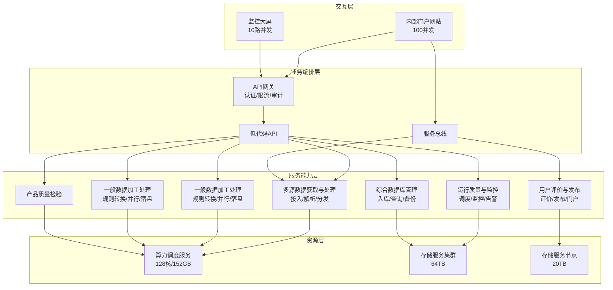
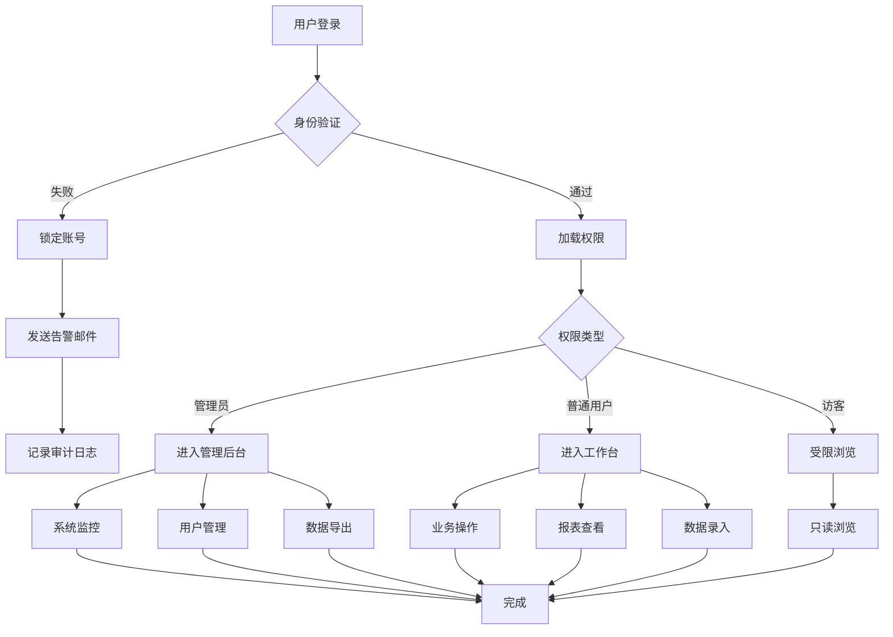
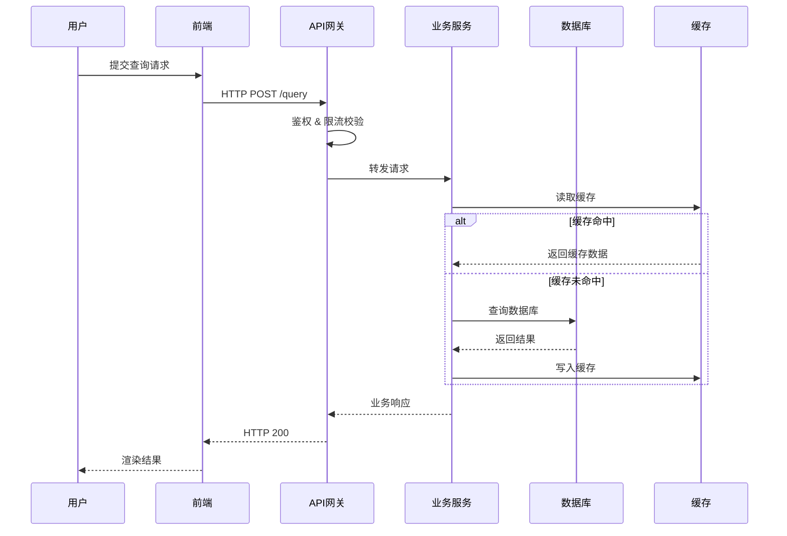
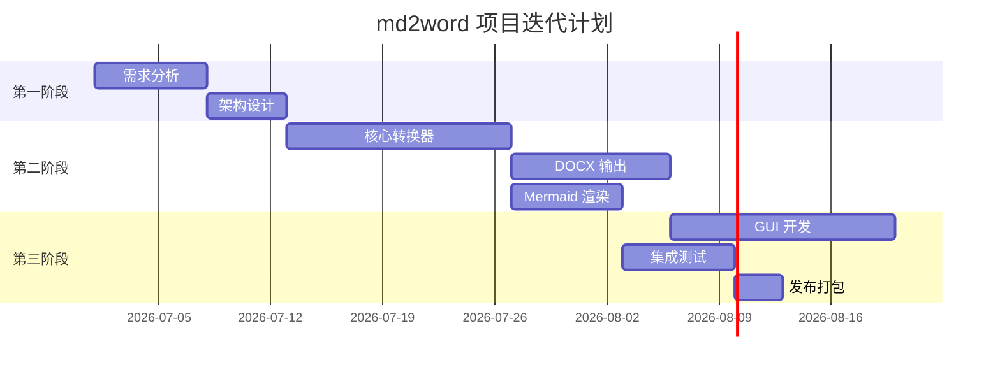
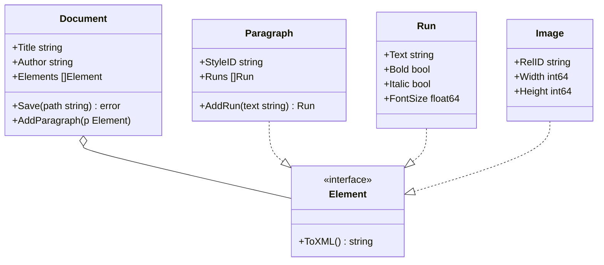
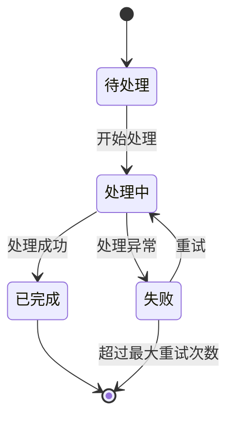
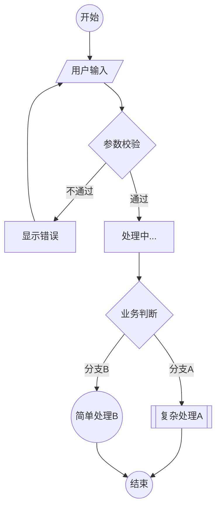

# md2word Mermaid 复杂测试

本文档用于测试各种复杂 Mermaid 流程图在 Word 文档中的渲染和尺寸适配。

---

## 1. 多层级架构图（类似业务总体架构）

参照用户提供的多层架构图，包含分组、子图、跨子图连接。

---

## 2. 纵向决策流程图（高度大于宽度）

测试高度方向的图是否会被压扁或正确缩放。

---

## 3. 时序图

---

## 4. 甘特图

---

## 5. 横向超宽流程图（容易溢出页面）

测试极端宽度情况下的边界处理。

---

## 6. 类图

---

## 7. 状态机图

---

## 8. 圆形节点决策图

