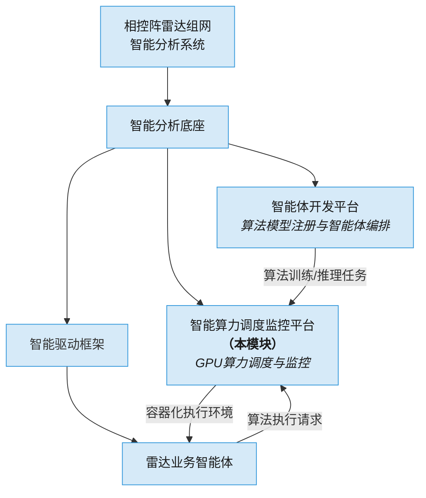
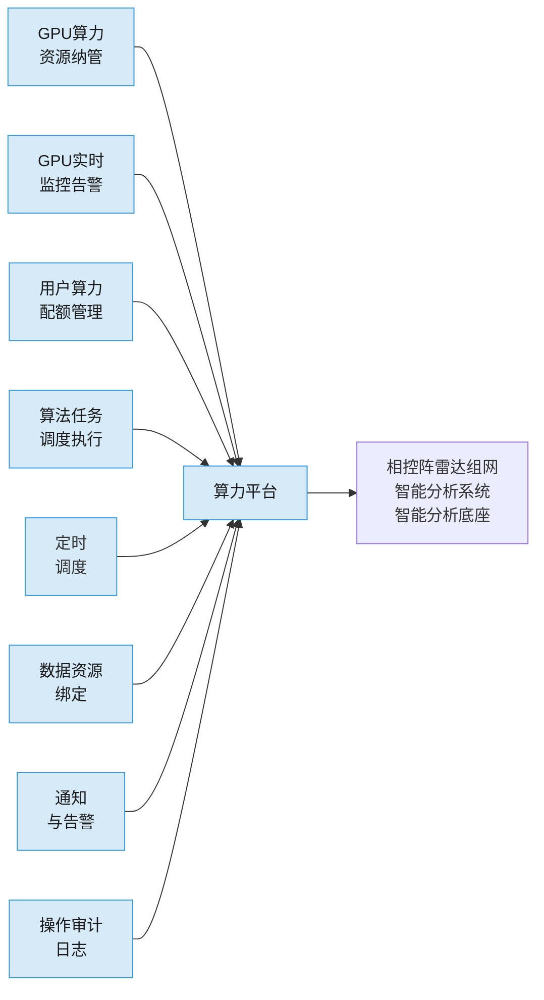
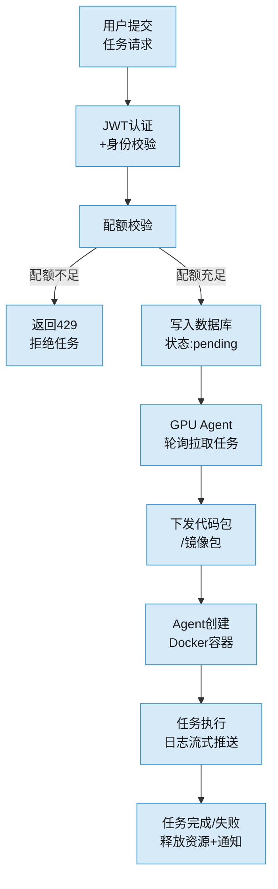
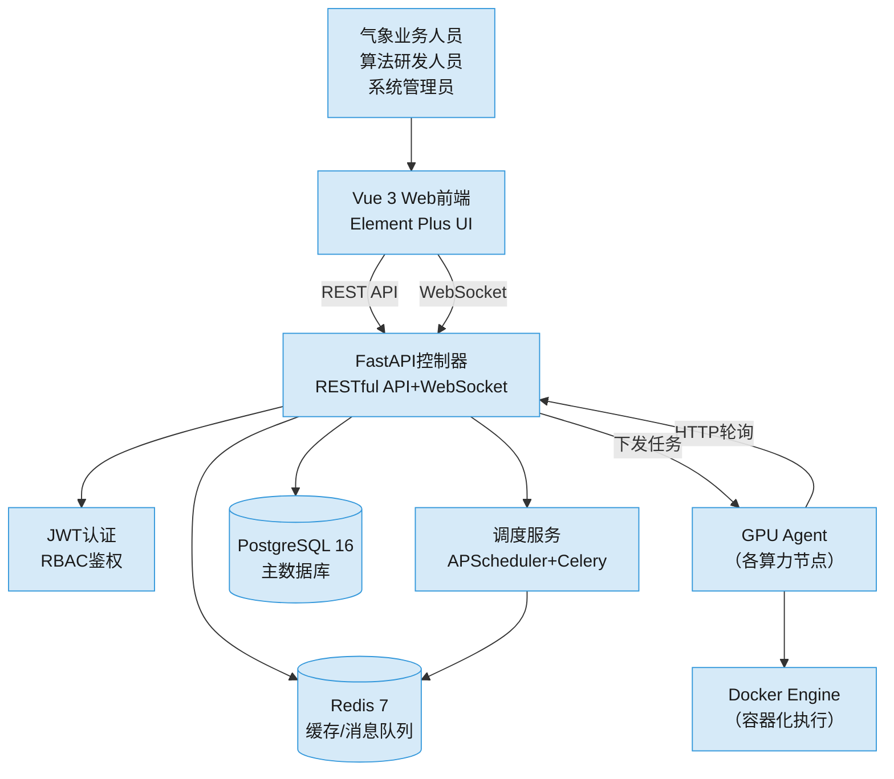
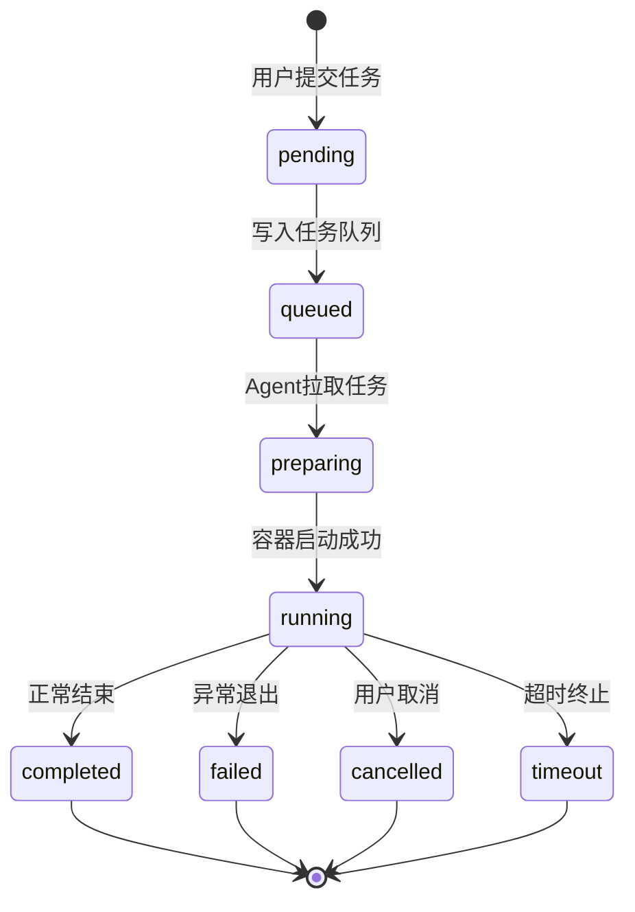
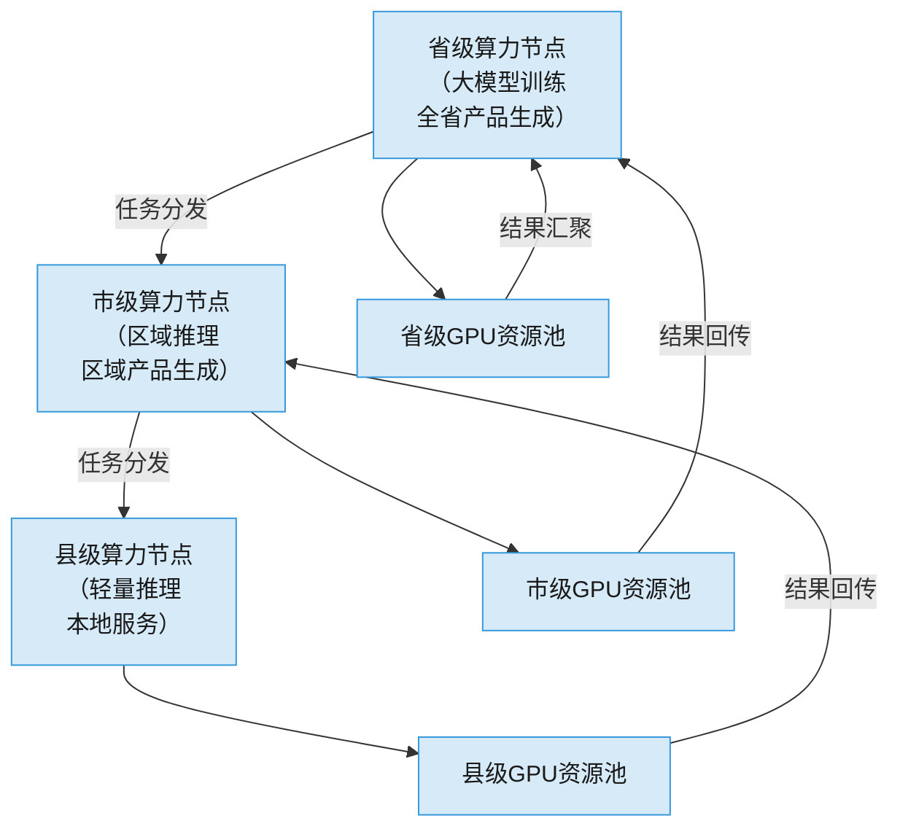
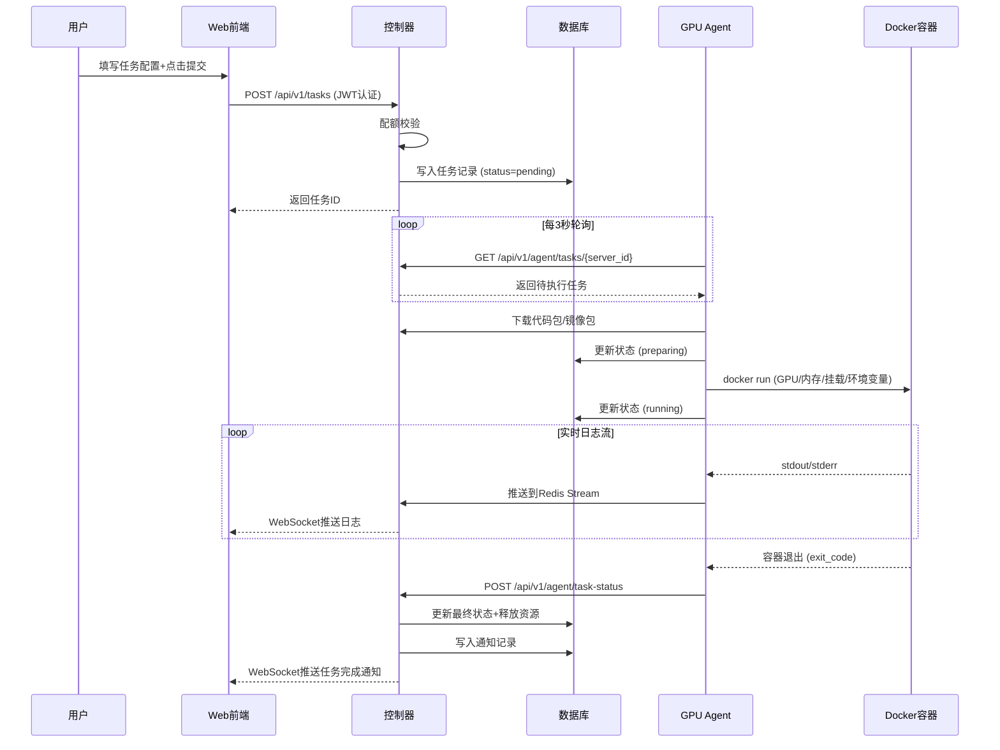

# 云南软件部分-投标文件技术部分

## 1.4.5.4.1 智能分析底座

### 1.4.5.4.1.2 智能算力调度监控平台功能模块需求分析

#### 1.4.5.4.1.2.1 模块应用场景概述

智能算力调度监控平台（以下简称"算力平台"）是相控阵雷达组网智能分析系统中智能分析底座的核心支撑模块。相控阵雷达组网系统通过多部相控阵雷达的高分辨率、高刷新率协同观测，形成持续不断的海量气象探测数据流，这些数据需要经过AI模型推理、深度学习训练、大规模并行计算等算法引擎进行智能处理，从而对雷达回波、风场反演、强对流识别、降水估测、冰雹判别、龙卷风预警等气象业务产品进行自动化生成。

随着系统接入雷达数量不断增加，以及AI算法模型持续迭代更新，GPU算力资源的统一调度与高效利用成为制约系统整体性能的关键因素。在多雷达、多算法、多任务并发运行的业务场景下，算力资源若缺乏统一管控，极易出现资源竞争冲突、关键任务延迟、低优先级任务长期占用高端GPU等结构性问题，直接影响气象业务产品的时效性和准确性。

从业务规模看，云南省省级部署的高分辨率相控阵雷达网络涵盖数十部雷达站，各雷达每日产生的原始I/Q数据和雷达基数据（基折射率、径向速度、谱宽）总量达TB级。这些数据进入智能分析底座时，需要经过质控处理、特征提取、AI推理、产品生成等多个计算密集型环节，每个环节均涉及不同的深度学习模型或经典算法，计算需求从单GPU轻度推理到多GPU分布式训练跨度巨大。具体而言，雷达回波分类模型（如基于ResNet/Transformer架构的分类器）单次推理需占用约4~8GB显存、耗时数秒；三维风场反演算法对多雷达基数据进行配准和反演，单次计算需占用12~24GB显存、耗时数十秒至数分钟；而AI模型的年际数据集增量训练任务可能需占用多张GPU卡并行训练数小时甚至数天。不同计算需求的算法任务并发运行时，若无智能调度，极易出现显存碎片化、GPU利用率不均衡、关键业务任务被低优先级任务阻塞等问题。

算力平台正是面向上述痛点构建的专用模块。平台面向多服务器、多GPU节点的分布式算力环境，提供算力资源统一纳管、任务智能调度、资源隔离与配额管控、实时运行监控等核心能力，支撑智能分析底座中各类AI算法的稳定、高效、有序运行。平台向上对接智能体开发平台，为各类雷达业务智能体提供模型训练与推理所需算力；向下纳管省级、市级、县级气象部门部署的各类GPU算力节点，形成全省一体化的智能算力支撑体系。

本模块的典型应用场景包括以下四个方面。

**场景一：多算法并发执行**

在强对流天气过程等业务高峰期，系统需要同时运行降水估测、风场反演、冰雹识别、龙卷风判别、雷达回波外推等多个AI算法模型。不同算法的算力需求差异显著，有些需要整张高端GPU卡进行大模型推理，有些仅需部分GPU资源进行轻量计算。算力平台负责按照算法优先级和GPU资源可用情况，进行智能任务排队与分配，确保灾害性天气识别等关键业务算法优先获得算力资源，防止资源竞争导致的服务延迟，保障气象预警业务的时效性。

**场景二：AI模型训练与推理并行**

雷达数据驱动的AI模型需要持续利用历史观测数据进行增量训练与版本更新，同时保持已部署模型的实时推理服务不中断。训练任务通常占用大量GPU资源和较长时间，推理任务则要求低延迟响应。算力平台支持在同一GPU集群上合理分配推理任务与训练任务的资源份额，通过容器化隔离和配额管控，实现推理低延迟与训练高吞吐的双重保障，互不干扰。

**场景三：省市县多级算力协同**

在省级、市级、县级气象部门均部署有算力节点的体系架构下，算力平台支持多节点算力资源的统一视图和跨节点任务分发。省级算力节点承担大模型训练和全省性产品生成任务，市县级算力节点承担本地化推理和区域产品生成任务。平台实现省级集约计算与市县级轻量推理的协同联动，支持将特定算法任务从省级分发至多个市县节点并行执行，并将各节点推理结果统一汇聚到省级系统，形成联合分析产品。

**场景四：算法开发与测试环境管理**

算法研发人员需要在相对隔离的环境中进行模型调试、代码测试与版本迭代，避免对生产业务造成干扰。算力平台提供基于Docker容器隔离的执行环境，支持算法代码包上传、Docker镜像管理及实时日志查看，每位研发人员在其配额范围内获得独立的容器化运行环境，大幅降低算法开发迭代成本，同时保障生产环境的稳定和安全。

**场景五：模型版本管理与持续集成**

相控阵雷达数据分析的AI模型需根据季节变化、新型天气现象和观测数据积累持续迭代。算力平台支持模型版本管理，维护模型版本与运行实例的映射关系。智能体开发平台完成模型新版本训练后，通过算力平台将新版本部署到GPU节点，平台支持灰度发布策略（先分配少量推理流量验证新版本，确认无退化后全量切换）与快速回滚（一键回退至历史版本）。模型版本切换全流程与任务调度、配额管理深度集成，操作均记录审计日志，保障迭代过程规范可追溯。

**场景六：智能驱动框架算法执行**

灾害事前感知、落区智能研判、事后复盘等雷达业务智能体在执行业务时，通过统一算法执行请求接口将计算任务提交给算力平台。平台根据实时性要求选择调度模式：强对流监测等低延迟实时推理采用同步调用，立即分配GPU资源并同步返回结果；历史数据批量分析等耗时处理采用异步调用，提交后返回任务ID，智能体通过回调获取结果。模式差异化设计确保全类型智能体执行效率最优。

算力平台在整体系统中的位置关系如下。智能分析底座作为相控阵雷达组网智能分析系统的核心中间层，其内部包含智能体开发平台和算力平台两大模块。智能体开发平台负责AI算法模型的注册、编排与智能体构建，算力平台负责为各类智能体提供模型训练与推理所需的GPU算力资源。智能驱动框架作为上层业务智能体（灾害事前感知、落区智能研判、事后复盘等）的运行载体，其算法执行依赖算力平台提供的容器化运行环境。算力平台是整个智能分析体系的资源基石，其调度效率与监控能力直接决定上层智能业务的响应速度和稳定性。



***

#### 1.4.5.4.1.2.2 功能需求分析

##### 1.4.5.4.1.2.2.1 GPU算力资源纳管

系统需支持多台GPU服务器的统一接入与管理。相控阵雷达组网系统涉及的算力节点分布于省级、市级、县级等多个层级，物理位置分散，GPU型号异构，需要平台具备跨地域、跨网段、异构设备的统一纳管能力。

具体功能需求如下。第一，支持通过SSH安全连接方式接入异构GPU服务器，包括NVIDIA A100、V100、RTX 4090、RTX 3090等各类GPU设备所在的服务器节点，兼容不同厂商、不同代次的GPU硬件。第二，支持GPU设备的自动发现与注册，在服务器接入后自动获取GPU型号、显存容量、CUDA版本、驱动版本等硬件和软件环境信息，无需人工逐张卡录入。第三，支持GPU服务器的增删改查全生命周期管理，管理员可在线添加新GPU节点或下线维护节点，下线节点不再参与任务调度但历史数据保留。第四，支持跨机房、跨网段的分布式GPU服务器统一管理，适应省市县三级分散部署的网络拓扑。第五，支持按行政层级（省/市/县）对服务器节点进行逻辑分组管理，省级管理员可查看辖区内所有市县算力节点的资源状态，市级管理员仅可管理本市范围内的算力节点，县级用户仅可使用经授权的算力资源。

##### 1.4.5.4.1.2.2.2 GPU实时监控与告警

系统需对所有接入GPU进行实时状态采集与可视化展示，为系统管理员和算法用户提供直观的资源使用视图，支撑运维决策和任务调度优化。

具体功能需求如下。第一，实时采集GPU利用率（%）、显存使用量（MB/GB）、显存总量、GPU温度（℃）、GPU功耗（W）等关键指标，采集间隔不大于5秒，确保监控数据的实时性。第二，支持WebSocket推送机制，前端监控界面实现毫秒级实时刷新，用户无需手动刷新即可看到最新GPU状态。第三，提供历史资源使用趋势查询功能，支持按小时、天、周、月等时间粒度查询GPU历史指标，辅助容量规划与性能分析。第四，支持GPU状态告警机制，当GPU温度超过阈值、显存使用率超过阈值、设备或服务器离线等异常状态发生时，系统实时推送告警通知给相关管理员，确保故障及时发现和处理。第五，监控视图支持分级展示，管理员可查看全部服务器和GPU的全局监控视图，普通用户仅可查看自身任务所占用的GPU资源状态，信息隔离保障安全。

##### 1.4.5.4.1.2.2.3 用户算力配额管理

系统需支持细粒度的用户资源配额管控，防止单用户或单任务过度占用算力资源，保障多用户共享环境下的公平性和系统整体稳定性。

具体功能需求如下。第一，管理员可为每位用户设置多维度的算力配额，包括允许使用的GPU UUID列表、最大CPU核数、最大内存（RAM）容量、最大显存（VRAM）容量、最大并发任务数、单任务最大运行时长等六个维度，全面覆盖任务执行所需的各类计算资源。第二，配额体系须支持动态调整，管理员修改用户配额后实时生效，正在运行的任务不受影响，新提交的任务按新配额校验。第三，系统须在任务提交时进行配额校验，计算该用户当前所有活动任务（状态为待提交、排队中、准备中、运行中）已占用的资源总量，加上本次任务申请资源量，若超出配额则拒绝任务提交，并向用户返回明确的配额超限提示信息。第四，支持管理员查看全部用户的配额使用概况，包括每用户的已用资源量、总配额、使用率等，以可视化图表形式展示全局资源分配状态。第五，配额模型须支持省市县分级管理场景，上级管理员可为下级用户分配配额，下级管理员只能在本级配额范围内为下属用户分配资源。

##### 1.4.5.4.1.2.2.4 算法任务调度与执行

系统需提供完整的AI算法任务生命周期管理能力，覆盖任务从提交到终止的全过程，并为用户提供透明的执行状态追踪。

具体功能需求如下。第一，支持任务创建功能，用户可指定目标服务器、GPU设备选择、CPU核数、内存容量、显存容量等资源参数，也可由系统根据配额范围自动分配最优GPU节点。第二，支持两种任务部署方式：算法代码包（ZIP格式）上传方式和Docker镜像包（TAR格式）上传方式，适应不同算法团队的开发和交付流程。第三，支持容器化隔离执行，每个任务在独立的Docker容器中运行，容器间CPU、内存、显存、GPU设备完全隔离，确保不同任务之间互不干扰，同时提供一致的运行环境。第四，支持实时日志流功能，任务启动后用户可在界面实时查看容器标准输出和标准错误的日志流，日志延迟不超过500毫秒，便于算法调试和运行状态判断。第五，支持任务取消操作，用户在任务完成前可主动取消任务，取消后容器立即停止并释放所占用的GPU和其他资源。第六，支持任务超时自动终止机制，防止僵尸任务长期占用资源，超时时间以用户配额中的最大运行时长为准。第七，提供任务状态全生命周期追踪能力，任务状态包括：待提交（pending）、排队中（queued）、准备中（preparing）、运行中（running）、已完成（completed）、失败（failed）、已取消（cancelled）、超时（timeout）共八种状态，状态转换完整记录并可供查询。

##### 1.4.5.4.1.2.2.5 定时调度

系统需支持算法任务的定时自动触发，满足周期性业务产品生成的自动化需求，减少人工干预，提高业务运行的稳定性。

具体功能需求如下。第一，支持基于Cron表达式的定时调度配置，用户可灵活设置任务的执行周期，包括每日固定时间、每周指定日期、每月指定日期等多种周期模式，适应气象业务产品生成的各类时间规律。第二，支持调度任务的启用和停用操作，停用的调度任务不会触发新的任务实例，但调度配置保留，可随时重新启用。第三，支持查看调度任务的下次执行时间预估，用户在配置调度任务时可预览未来多次执行时间，确认配置正确性。第四，支持基于已有任务模板快速创建定时调度，用户可将其它任务的配置保存为模板，新建调度时直接引用，减少重复配置工作。第五，定时调度与配额体系联动，调度任务触发时同样进行配额校验，若触发时配额已超限，则该次调度自动跳过并记录日志，等待下一周期重新尝试。

##### 1.4.5.4.1.2.2.6 数据资源绑定

系统需支持将存储和计算资源与任务执行环境绑定，使算法任务能够访问所需的训练数据、模型文件和外部数据库，同时保证敏感连接信息的安全管理。

具体功能需求如下。第一，支持目录挂载类资源的绑定，包括本地路径（host_path）、NFS网络文件系统、CIFS/SMB共享目录、远程目录（remote_dir）四种类型，挂载类资源在任务容器启动时转换为Docker卷挂载或绑定挂载，算法任务可直接读写。第二，支持连接字符串注入类资源的绑定，包括MySQL数据库、PostgreSQL数据库、Redis缓存、S3对象存储、MinIO对象存储、OSS对象存储六种类型，连接信息通过容器环境变量的方式注入，算法任务从环境变量读取连接配置。第三，敏感配置（数据库密码、对象存储密钥等）须加密存储，不可明文持久化，仅在任务启动时解密并注入容器环境变量，任务完成后从内存中清除。第四，数据资源支持按用户隔离，用户只能绑定自己创建或经授权访问的数据资源，不能访问其他用户的数据资源，保障数据安全。

##### 1.4.5.4.1.2.2.7 SSH终端代理

系统需提供浏览器内的GPU服务器SSH终端功能，使系统管理员和授权用户能够直接在Web界面操作GPU服务器，进行故障排查、环境检查和手动干预，无需离开平台切换到独立的SSH客户端。

具体功能需求如下。第一，用户可通过浏览器直接连接具有权限的GPU服务器终端，连接基于WebSocket代理实现，无需在本地安装SSH客户端软件。第二，SSH会话支持完整的命令行交互操作，包括命令输入、输出显示、Tab补全、Ctrl+C中断等常规终端操作。第三，SSH访问权限与用户角色绑定，普通用户默认无SSH访问权限，仅管理员和被明确授权的用户可开启SSH终端功能。第四，所有SSH操作记录日志，包括登录时间、退出时间、操作命令等，纳入审计日志体系，满足安全合规要求。

##### 1.4.5.4.1.2.2.8 通知与告警

系统需具备完善的通知机制，确保用户及时获知任务执行结果和系统异常状态，提高运维响应速度和使用体验。

具体功能需求如下。第一，任务完成、任务失败、任务超时等关键任务事件须实时推送通知给任务提交者，通知内容包含任务名称、事件发生时间、任务执行耗时（完成时）或错误简述（失败时）等信息。第二，GPU设备告警（高温、显存不足、设备离线等）须实时推送通知给系统管理员，通知内容包含设备名称、所属服务器、告警类型和发生时间。第三，支持通知消息列表查看，用户可查看历史所有通知记录，已读和未读通知有明确区分。第四，前端界面展示未读通知角标数量，用户登录后可直接看到待处理通知数量，引导用户及时处理。第五，通知支持按类型过滤和按时间排序，方便用户在大量通知中快速定位所需信息。

##### 1.4.5.4.1.2.2.9 操作审计日志

系统须对所有用户操作进行全量审计记录，建立完整的操作追溯体系，满足信息安全合规要求，并为故障排查和责任定位提供依据。

具体功能需求如下。第一，审计内容包括操作类型（如CREATE_TASK、UPDATE_QUOTA、ADD_SERVER、DELETE_USER等）、操作用户、操作时间、操作对象（资源类型和资源ID）、操作结果（success/failed）、操作来源IP地址、操作详情（JSON格式，包含变更前后的关键字段值）等完整信息，确保任何操作均可追溯到具体人员、时间和内容。第二，审计日志写入时即锁定不可修改或删除，数据库层面通过撤销DELETE/UPDATE权限、仅保留INSERT权限实现物理防篡改，防止恶意操作掩盖痕迹。第三，管理员可按用户名称、操作类型、操作对象类型、操作结果、时间范围等多个维度进行组合过滤查询，快速定位特定操作记录，支持全文搜索操作详情字段。第四，审计日志支持按筛选条件导出为Excel文件，用于离线审计、合规报备或数据分析，导出过程异步执行避免长时间等待。第五，审计日志保留期不少于180天，在线数据180天内可实时查询，超期数据自动归档到对象存储或专用归档数据库，归档数据可离线查询但不可删除，满足信息安全等级保护合规要求。



***

#### 1.4.5.4.1.2.3 信息流程需求分析

##### 1.4.5.4.1.2.3.1 任务提交与执行信息流

算法任务从用户提交到最终完成的完整信息流转过程如下。用户通过Web前端提交任务创建请求，请求中携带任务名称、目标服务器、GPU选择、CPU/内存/显存资源申请量、代码包或镜像包引用、最大运行时长等参数。控制器接收到请求后，首先进行JWT身份认证，验证用户Token的有效性和权限范围。认证通过后，控制器查询该用户的配额使用记录，计算当前活动任务已占用资源总量，与本次申请资源量相加，判断是否超出该用户的配额上限。若超出配额，控制器立即返回HTTP 429响应，提示用户配额不足，并说明当前已用资源和总配额；若未超出配额，控制器将任务记录写入PostgreSQL数据库，任务初始状态为"待提交（pending）"，同时预分配资源占用记录，防止并发提交导致配额超额。

任务写入数据库后，部署在目标GPU服务器上的GPU Agent通过HTTP轮询方式（默认每3秒一次）向控制器拉取待执行任务列表，轮询请求中携带服务器ID，控制器仅返回发往该服务器的待执行任务。Agent获取到任务后，从控制器下载任务代码包或镜像包到本地服务器，然后更新任务状态为"准备中（preparing）"。随后Agent根据任务配置创建Docker容器，容器启动时绑定指定的GPU设备、CPU核心限制、内存限制、目录挂载和环境变量，确保任务在隔离环境中运行。容器启动成功后，Agent将任务状态更新为"运行中（running）"，并开始采集容器标准输出和标准错误日志，通过Redis消息队列流式推送到前端，用户在任务详情界面可实时查看运行日志。

任务执行完毕后（容器正常退出或异常退出），Agent将最终执行状态（完成/失败/已取消/超时）回传给控制器，控制器更新数据库中的任务状态，释放预分配的GPU资源占用记录，同时写入通知记录，通过WebSocket推送任务结果通知给任务提交者。若任务执行失败，错误信息一并记录到任务记录和通知消息中，便于用户排查问题。

异常处理流程方面，平台针对任务执行过程中可能出现的各类异常情况设计了完善的容错与恢复机制。在容器启动失败场景下，若Agent在下载代码包或镜像包过程中遇到网络中断，Agent将自动重试3次（间隔5秒），重试失败后向控制器上报任务状态为"失败"并附带错误码NETWORK_ERROR，控制器释放资源占用并通知用户。在容器运行时崩溃场景下，若Agent检测到Docker容器异常退出（exit code非0），Agent将捕获容器退出码、错误输出和最后100行日志作为错误信息上报，控制器在通知消息中展示该错误信息并提示用户排查。在Agent本身失联场景下，若Agent连续2个心跳周期（默认10秒）未上报心跳，控制器将所有发往该服务器的任务标记为"失败"并释放资源；当Agent恢复后，控制器通知Agent清理残留容器。在用户取消任务场景下，控制器立即将任务状态更新为"已取消"，并向Agent下发停止指令，Agent执行docker stop命令停止容器并清理资源，整个取消过程不超过30秒。

此外，平台还须处理以下边缘场景。并发提交溢出场景：当多个用户同时提交多个任务导致某GPU排队任务激增时，队列深度上限默认设置为100，超出后新任务直接拒绝提示"GPU繁忙，请稍后重试"，避免队列堆积导致延迟雪崩。数据库主库故障场景：PostgreSQL主从切换由Patroni自动完成（切换时间≤30秒），期间控制器自动重连并从库转为新主库，已提交但未写入的任务返回错误由用户重试。Redis节点故障场景：Sentinel检测到主节点故障后自动提升从节点（切换时间≤10秒），期间的WebSocket推送暂停但连接不断开，恢复后自动续推。磁盘空间不足场景：GPU Agent监控宿主机磁盘使用率，超过90%时暂停接受新任务并在Agent状态中标红告警；控制器侧面监控数据库磁盘使用率，超过80%时触发告警通知管理员扩容。

##### 1.4.5.4.1.2.3.2 GPU监控信息流

GPU监控数据的采集和推送采用独立的异步信息流，不影响任务调度主流程的性能。部署在每台GPU服务器上的GPU Agent内置监控采集模块，每隔5秒调用NVML（NVIDIA Management Library）或执行nvidia-smi命令，采集该服务器上所有GPU的利用率、显存使用量、显存总量、温度、功耗等指标数据。采集完成后，Agent通过HTTP POST请求将GPU指标数据上报给控制器的心跳接口（/agent/heartbeat），请求中携带服务器ID和所有GPU的最新指标。

控制器接收到心跳上报后，更新PostgreSQL数据库中GPU状态表的对应记录，确保数据库中保存的是最新监控数据。与此同时，控制器通过WebSocket连接，将最新GPU指标数据推送给所有已订阅监控数据的前端客户端。前端监控界面接收到推送数据后，实时更新GPU状态面板的展示内容，包括利用率进度条、显存使用饼图、温度指示器等可视化元素。若某台服务器上的Agent停止上报心跳（如服务器宕机或网络中断），控制器在连续多个采集周期未收到心跳后，自动将该服务器上所有GPU的状态标记为"离线"，并触发设备离线告警通知。

监控数据除了实时推送展示外，还须实现历史数据的持久化存储与趋势分析。每个GPU每5秒产生的指标数据点被写入时序数据表（选用InfluxDB或PostgreSQL时序分区表），保留期90天。前端监控仪表盘提供灵活的历史趋势查询能力，用户可按小时、天、周、月等粒度查询GPU历史指标，通过ECharts折线图和面积图直观展示GPU负载变化趋势。趋势分析数据可辅助运维人员进行容量规划，例如通过分析AI训练任务的GPU利用率曲线，判断当前算力资源是否满足业务增长需求，或识别出常态化低利用率的GPU设备以进行资源重分配。历史指标的聚合存储采用按小时预聚合（平均、最大值、最小值、P95值）策略，查询时直接使用预聚合结果而非扫描原始数据点，确保长时间跨度的查询响应时延控制在2秒以内。

##### 1.4.5.4.1.2.3.3 省市县协同信息流

在省市县三级算力协同场景下，信息流涉及跨行政层级的任务分发与结果汇聚。省级业务系统发起协同任务时，指定参与计算的市县级算力节点列表和算法包，省级算力平台根据分发策略（按区域、按负载或按算法类型）将任务分解并下发至各目标节点。各节点接收到任务后，由本地GPU Agent按照前述任务执行信息流完成容器创建、算法执行和结果输出。

各节点任务执行完成后，将推理结果或训练模型文件上传至省级系统指定的共享存储（如S3/MinIO对象存储或NFS网络文件系统），并通过API回调通知省级算力平台任务完成。省级算力平台在收到所有参与节点的完成通知后，从共享存储中汇聚各节点结果数据，由省级智能分析模块生成联合分析产品，并通过通知机制告知省级业务人员协同任务已完成。整个协同过程中，各节点的任务状态、日志和GPU监控数据均实时汇聚至省级平台，省级管理员可在统一视图中监控所有参与节点的执行进度和资源使用情况。

省市县协同任务的分发策略支持三种模式。按区域分发策略适用于区域精细化产品生成任务，如将滇中、滇西、滇南等不同区域的风场反演任务分别下发至对应区域的市级或县级节点处理，避免不必要的数据跨域传输。按负载分发策略适用于通用计算任务，省级控制器实时感知各节点的GPU利用率和排队任务数，将任务优先分发至负载较低的节点，实现全省算力资源的负载均衡。按算法类型分发策略适用于专用硬件场景，如将大型Transformer模型推理任务分发至配备A100 GPU的省级高性能节点，将轻量CNN推理任务分发至配备RTX 4090的县级经济型节点，实现硬件与算法的优化匹配。三种策略可组合使用，默认优先级为：按负载 > 按区域 > 按算法类型，管理员可根据业务需求灵活调整。



***

#### 1.4.5.4.1.2.4 输入输出数据需求分析

##### 1.4.5.4.1.2.4.1 输入数据

| 数据类别 | 数据名称 | 数据类型 | 数据说明 |
|---------|---------|---------|---------|
| 用户认证数据 | 用户名/密码 | 字符串 | 用于登录认证，密码经bcrypt哈希后存储，认证通过后签发JWT Token |
| 用户认证数据 | JWT Token | 字符串 | 后续所有API请求的认证凭证，通过Authorization: Bearer <token>头传递 |
| 任务配置数据 | 任务创建请求 | JSON结构体 | 包含目标服务器ID、GPU选择方式、CPU/内存/显存申请量、运行时长限制、入口命令等 |
| 算法代码数据 | 代码包ZIP文件 | 二进制文件 | 用户上传的算法代码压缩包，由控制器下发至目标服务器，由Agent解压后执行 |
| 算法镜像数据 | Docker镜像TAR文件 | 二进制文件 | 用户上传的Docker镜像导出包，由控制器下发至目标服务器，由Agent加载后运行 |
| 调度配置数据 | Cron表达式 | 字符串 | 定时调度任务的执行周期配置，遵循标准Cron格式（分 时 日 月 周） |
| 数据资源配置数据 | 资源绑定配置 | JSON结构体 | 包含资源类型、连接参数、容器挂载路径等，用于任务执行环境的数据绑定 |
| GPU监控数据 | 指标采集上报 | JSON结构体 | 由GPU Agent每5秒采集并通过HTTP POST上报，包含各GPU的利用率、显存、温度等 |
| 节点配置数据 | 算力节点接入配置 | JSON结构体 | 省级管理员配置市县级算力节点的SSH连接信息、节点层级、所属行政区域等 |

##### 1.4.5.4.1.2.4.2 输出数据

| 数据类别 | 数据名称 | 数据类型 | 数据说明 |
|---------|---------|---------|---------|
| 任务执行结果数据 | 任务状态响应 | JSON结构体 | 反映任务最终执行状态，包含任务ID、名称、状态、开始时间、完成时间、执行摘要等 |
| 任务执行日志数据 | 实时日志流 | 文本流 | 容器标准输出和标准错误的实时日志，通过Redis Stream或WebSocket推送到前端 |
| GPU监控输出数据 | 实时GPU状态 | JSON/WebSocket帧 | 最新GPU指标数据，通过WebSocket推送至前端监控界面，刷新间隔不大于5秒 |
| 通知消息数据 | 事件通知记录 | JSON结构体 | 任务事件和GPU告警的通知内容，包含通知类型、关联对象、发生时间、已读状态等 |
| 操作审计数据 | 审计日志记录 | JSON结构体 | 全量用户操作记录，包含操作类型、操作用户、操作时间、操作对象、操作结果、来源IP等 |
| 配额使用统计数据 | 用户资源使用报告 | JSON结构体 | 管理员视图中的全局配额使用概况，包含每用户的已用资源量、总配额、使用率等 |
| 协同任务结果数据 | 跨节点任务汇聚结果 | JSON/文件 | 省市县协同场景下，各节点任务执行结果汇聚至省级系统后的联合分析产品数据 |

以上输入输出数据涵盖了算力平台与用户、上游智能体开发平台、下游GPU Agent之间交互的核心数据结构。这些数据结构将作为后续系统设计中API接口规范、数据库表设计的重要参考依据，同时也是前后端开发人员对齐接口契约的基础文档。所有JSON结构体的字段命名遵循驼峰命名法（camelCase），时间格式统一采用ISO 8601标准（如"2026-06-01T10:00:00Z"），ID字段统一采用UUID v4格式，以保证跨系统数据交换的一致性和可读性。

***

#### 1.4.5.4.1.2.5 功能界面需求分析

##### 1.4.5.4.1.2.5.1 界面整体风格需求

算力平台的Web前端界面整体采用现代简约的政务信息化系统风格，主色调以浅蓝色（#D6EAF8）和白色为主，搭配深蓝色（#2C3E50）作为文字和强调色，整体视觉效果庄重、清晰、专业，符合气象业务部门的使用习惯。界面布局采用左侧导航栏+右侧内容区的经典后台管理系统结构，左侧导航栏宽度固定，右侧内容区自适应屏幕宽度。顶部设置全局Header，包含系统名称、用户信息、未读通知角标和功能入口。

界面须支持响应式布局，在最小1280px宽度屏幕上完整显示所有功能元素，在1920px及以上宽度屏幕上利用更大空间展示更多监控数据和任务列表列。字体采用思源黑体或系统默认无衬线字体，正文字号14px，标题字号16~20px，保证在业务人员常用显示设备上的可读性。所有交互元素（按钮、输入框、下拉选择等）须具备明确的可点击视觉反馈，鼠标悬停时颜色变化，输入框获得焦点时有边框高亮提示。

##### 1.4.5.4.1.2.5.2 各功能页面对应关系

算力平台前端共包含以下主要功能页面，各页面对应需求分析中描述的功能需求。

登录页面：用户通过用户名和密码登录系统，登录成功后跳转至首页。登录页面须支持JWT Token的自动续期，用户在Token过期前无感知地完成Refresh Token换取新Access Token的过程，无需重新登录。

GPU监控仪表盘页面：对应GPU实时监控与告警功能需求。页面顶部展示全局算力资源概览卡片，包括在线服务器数量、总GPU数量、平均利用率、告警设备数量等关键指标。页面主体部分以卡片或表格形式展示每台服务器的GPU状态，每个GPU卡片展示利用率进度条、显存使用饼图、温度指示器、功耗数据和最后更新时间。页面支持按服务器筛选、按GPU状态筛选（在线/离线/告警）、按利用率范围筛选。管理员视图展示全部GPU，普通用户视图仅展示其任务所占用的GPU。

任务管理列表页面：对算任务调度与执行功能需求。页面以表格形式展示当前用户（或全体用户，取决于权限）的所有任务，表格列包括任务名称、状态、目标服务器、分配GPU、提交时间、开始时间、完成时间、操作按钮。任务状态以不同颜色标签展示，如绿色代表运行中、蓝色代表已完成、红色代表失败或超时、灰色代表已取消。页面支持按状态过滤、按时间排序、按任务名称搜索。

任务创建页面：用户通过该页面提交新的算法任务。页面包含服务器选择下拉框、GPU选择多选框（根据所选服务器动态加载）、CPU/内存/显存资源申请量输入框、代码包上传区域或镜像包上传区域、入口命令输入框、环境变量配置区、数据资源绑定区、最大运行时长输入框等表单项。表单提交前进行客户端校验，确保必填项完整、资源申请量不超过用户配额。提交成功后跳转至任务详情页面。

任务详情页面：展示单个任务的完整信息，包括基本配置信息、资源分配信息、状态变更历史时间线、实时日志展示区。日志展示区以终端风格黑色背景显示，支持自动滚动到底部、手动暂停滚动、日志搜索过滤、日志下载等功能。

服务器管理页面（管理员专用）：对应GPU算力资源纳管功能需求。页面以表格形式展示所有已接入的GPU服务器，表格列包括服务器名称、IP地址、SSH状态、GPU数量、在线状态、所属行政区域、描述信息、操作按钮。页面支持添加新服务器（弹窗表单，包含SSH连接测试功能）、编辑服务器信息、下线/上线服务器等操作。点击服务器名称可展开查看该服务器上所有GPU的详细信息。

配额管理页面（管理员专用）：对应用户算力配额管理功能需求。页面以表格形式展示所有用户及其配额配置，表格列包括用户名、角色、允许使用的GPU列表、最大CPU核数、最大内存、最大显存、最大并发任务数、最大运行时长、当前已用资源量、配额使用率。页面支持修改用户配额（弹窗表单）、查看用户资源使用详情。配额使用率以进度条和百分比数字同时展示，使用率超过80%时进度条变为橙色，超过95%时变为红色，直观提示资源紧张状态。

定时调度管理页面：对应定时调度功能需求。页面以表格形式展示所有定时调度任务，表格列包括调度名称、关联任务模板、Cron表达式、下次执行时间、启用状态、创建时间、操作按钮。页面支持新建调度任务、编辑调度任务、启用/停用调度任务、手动触发一次调度执行等操作。Cron表达式输入框旁边提供可视化Cron表达式生成器，用户可通过选择分、时、日、月、周的方式生成标准Cron表达式，降低使用门槛。

数据资源管理页面：对应用数据资源绑定功能需求。页面以表格形式展示当前用户创建的所有数据资源，表格列包括资源名称、资源类型、连接参数（敏感信息脱敏显示）、创建时间、操作按钮。页面支持新建数据资源（弹窗表单，根据资源类型动态显示不同字段）、编辑数据资源、删除数据资源。新建数据资源时，连接密码等敏感信息以密文输入框接收，提交后加密存储。

通知中心页面：对应通知与告警功能需求。页面以列表形式展示所有通知消息，未读通知以加粗字体和高亮背景区分。页面支持标记已读、全部标记已读、按通知类型过滤、按时间排序。点击单条通知可查看详细内容，并自动标记为已读。

审计日志查询页面（管理员专用）：对应操作审计日志功能需求。页面以表格形式展示全量操作审计记录，表格列包括操作时间、操作用户、操作类型、操作对象、操作结果、来源IP地址。页面支持按用户过滤、按操作类型过滤、按时间范围过滤、导出审计日志等功能。操作类型以分类标签展示，如"任务操作"、"服务器操作"、"用户管理操作"等，便于快速归类。

SSH终端页面（授权用户专用）：对应SSH终端代理功能需求。页面内置基于Web的SSH终端模拟器，用户选择目标服务器后，点击连接按钮即可在浏览器中打开终端会话。终端支持复制粘贴、全屏显示、断开重连等功能。

##### 1.4.5.4.1.2.5.3 省市县协同视图界面需求

在省市县三级协同场景下，须提供专用的协同视图界面，供省级管理员监控全局算力资源和处理跨节点任务。协同视图界面包含以下核心元素。全省算力资源总览仪表盘：以地图或列表形式展示省内各级算力节点的分布和状态，包括省级节点、各地市级节点、各县区级节点的GPU总量、在线GPU数量、平均利用率、当前运行任务数等关键指标，节点状态以颜色区分（绿色在线、灰色离线、橙色告警）。跨节点任务监控面板：展示当前正在执行的跨节点协同任务列表，每个任务显示任务名称、发起单位、参与节点列表、各节点执行状态、整体进度、开始时间等信息，省级管理员可在此面板中监控协同任务的执行进度，并在异常情况下进行干预。算力资源调度建议视图：基于各节点实时负载和历史使用趋势，系统自动生成算力资源调度建议，如建议将某类任务调度至负载较低的节点，或建议为某节点增加GPU设备等，以辅助省级管理员进行算力资源规划和优化决策。

##### 1.4.5.4.1.2.5.4 响应式布局需求

算力平台前端须适配不同尺寸的显示设备，主要适配场景包括：气象业务人员使用的台式机（通常1920×1080或更高分辨率）、便携式办公笔记本（通常1366×768或1440×900分辨率）、以及通过内网远程桌面访问的大屏显示终端。响应式布局通过CSS媒体查询和Element Plus栅格系统实现，核心原则是：在较大屏幕上展示更多表格列和监控卡片，在较小屏幕上自动隐藏非核心列、将多列布局转换为单列布局、将部分图表转换为可横向滚动的卡片组。所有功能页面在1280px宽度屏幕上均须完整可用，不得出现横向滚动条（表格内部横向滚动除外）或元素重叠错位等问题。

平台前端还须具备断线重连和离线容错能力。当WebSocket连接因网络波动中断时，前端自动启动指数退避重连策略（间隔1s、2s、4s、8s、16s……最大30s），重连成功后自动续订监控数据和日志流，期间中断的数据从服务端缓存中补推，确保不丢失关键监控信息。当服务器API不可用时，前端展示离线提示横幅，已加载的列表数据和图表保持可浏览状态，提交类操作按钮置灰禁用，避免无效操作。当用户Token即将过期时，前端自动调用/refresh接口无感知换新Token，用户无需重新登录。这些韧性设计确保平台在网络不稳定或服务短暂中断时仍能提供尽可能多的可用功能，降低运维场景下的使用体验中断。

前端技术选型方面，采用Vue 3渐进式JavaScript框架配合组合式API（Composition API）构建，使用Vite作为构建工具实现快速冷启动和热模块替换（HMR），开发语言采用TypeScript进行静态类型检查以提升代码质量。UI组件库选用Element Plus提供丰富的表单、表格、对话框等组件支持，图表库采用ECharts实现GPU监控仪表盘的趋势图、饼图、柱状图等数据可视化。状态管理使用Pinia替代传统Vuex方案，前端路由基于Vue Router实现，HTTP请求通过Axios封装并内置Token拦截器。国际化通过Vue I18n实现，文案统一抽取到语言资源文件，预留英文等多语言扩展能力。后端采用FastAPI异步Web框架、Pydantic v2数据验证、SQLAlchemy 2.0异步ORM、Celery分布式任务队列、APScheduler定时调度等主流技术栈，数据库采用PostgreSQL 16主库搭配Redis 7缓存，通过uvicorn高性能ASGI服务器部署。

***

### 1.5.2.1.5.1 智能分析底座模块

#### 1.5.2.1.5.1.2 智能算力调度监控平台功能模块设计

##### 1.5.2.1.5.1.2.1 模块功能概述

智能算力调度监控平台采用"控制器+远端Agent"的分布式架构设计，实现对多节点GPU算力资源的统一管控与智能调度。平台作为相控阵雷达组网智能分析系统中智能分析底座的核心资源支撑模块，向上为智能体开发平台提供模型训练与推理所需算力，为智能驱动框架中的各类雷达业务智能体提供容器化算法执行环境，向下纳管分布于省级、市级、县级气象部门的各类GPU算力节点，形成全省一体化的智能算力支撑体系。

平台由四大核心组件构成。第一，Web管控前端，基于Vue 3框架构建，采用Element Plus组件库实现界面展示，负责向系统管理员、算法研发人员和气象业务人员提供算力资源监控、任务管理、配额管理、审计查询等所有交互功能。第二，核心控制服务，基于FastAPI异步Web框架构建，提供RESTful API接口和WebSocket实时通信能力，负责处理所有前端请求、执行身份认证与权限校验、进行任务调度决策、管理数据持久化等操作。第三，后台任务引擎，基于Celery分布式任务队列和APScheduler定时调度框架构建，负责处理定时调度任务的触发、异步通知推送、审计日志异步写入等非实时性要求的后台操作。第四，GPU Agent，部署在每台GPU服务器上的轻量级代理程序，负责执行控制器下发的任务指令，管理本地Docker容器生命周期，采集GPU实时监控指标并上报给控制器。

平台具备六大核心能力。第一，GPU资源统一纳管能力，支持多台GPU服务器的统一接入，自动发现GPU设备，支持异构GPU硬件和跨网段分布式部署。第二，智能任务调度能力，基于用户配额感知的任务排队与分配策略，支持资源定向调度和自动选卡，确保关键业务算法优先获得算力资源。第三，容器化隔离执行能力，基于Docker的每任务一容器隔离机制，确保不同算法任务之间资源完全隔离，同时提供一致的运行环境。第四，实时监控与告警能力，GPU指标5秒级采集与毫秒级前端推送，支持历史趋势查询和多级告警机制。第五，细粒度权限管控能力，基于RBAC（角色基于访问控制）模型，支持超级管理员和普通用户两级角色，在省市县协同场景下支持多级管理员分权管理。第六，全量操作审计能力，所有用户操作均记录不可篡改的审计日志，满足信息安全合规要求，并为故障排查和责任定位提供依据。

平台主要技术指标如下。GPU指标采集间隔不大于5秒，任务提交到容器启动的端到端时延不大于30秒（使用本地已缓存镜像时），日志推送延迟P95不大于500毫秒，WebSocket连接支持不少于200并发会话，系统可用性不低于99.9%，GPU Agent掉线后自动恢复时间不大于60秒，任务超时强制终止响应时间不大于10秒，支持接入GPU服务器数量不少于50台，支持GPU设备总量不少于400个，单用户最大并发任务数可配置（默认20），密码存储采用bcrypt哈希算法，敏感配置采用应用层加密存储，API认证采用JWT Bearer Token机制，审计日志保留期不少于180天。



平台规划的五大核心性能指标如下。GPU指标采集间隔不大于5秒，通过Agent端的NVML API定时高频采集实现，确保监控数据新鲜度。任务提交到容器启动的端到端时延控制在不大于30秒（使用本地已缓存镜像），覆盖配额校验、任务写入、Agent轮询拉取、镜像加载、Docker容器启动的全链路耗时。日志推送延迟P95不大于500毫秒，从容器标准输出通过Agent→Redis Stream→WebSocket链路流式推送到前端，保障实时调试体验。WebSocket连接支持不少于200个并发会话，以支持多用户同时查看GPU监控和任务日志。API响应时延P95不大于300毫秒，普通CRUD操作（列表查询、详情查看等）通过合理索引和连接池优化保证。

平台可靠性设计遵循多重冗余原则。系统可用性目标不低于99.9%，即全年不可用时间不超过8.76小时，通过主备切换、进程守护、优雅降级等机制实现。GPU Agent掉线后通过守护进程自动拉起，恢复时间不大于60秒。任务超时后强制终止响应时间不大于10秒，通过控制器后台监控进程扫描running任务并发起强制停止实现。容器启动成功率不低于99%（排除镜像损坏等合理业务异常），通过镜像校验和重试机制保障。

平台向上游智能体开发平台提供四类标准化接口。模型训练任务接口：智能体开发平台提交训练任务请求（含模型ID、数据集ID、超参数配置、资源需求），算力平台返回训练结果（模型路径、训练指标），支持携带回调URL的同步调用模式。模型推理部署接口：提交推理服务部署请求（含模型ID、入口脚本、资源需求、副本数），算力平台创建常驻推理服务并返回访问端点，推理服务以Docker容器长驻方式多副本运行实现负载均衡。模型版本管理接口：支持查询已部署模型版本列表、激活指定版本、回滚到历史版本等操作，实现灰度发布与快速回滚。算法执行请求接口：雷达业务智能体通过该接口提交算法执行请求，支持同步（实时推理）和异步（批量处理）两种调用模式。

平台向下游GPU Agent提供五类标准化接口。任务拉取接口：Agent通过HTTP GET定时拉取发往本节点的待执行任务，控制器按server_id筛选返回。代码包/镜像包下载接口：Agent下载任务所需的ZIP代码包或TAR镜像包。任务状态更新接口：Agent上报任务状态从pending到终态的变化。实时日志批量上报接口：Agent将容器日志按批次通过HTTP POST上报，减少请求次数。心跳上报接口：Agent每5秒上报服务器和GPU状态指标，控制器据此更新在线状态、监控指标和告警。

平台支持四种部署模式适应不同规模。单机部署模式适用于县级中小规模试点，所有组件部署于同一台服务器，使用Docker Compose编排，最低资源需求为CPU 16核、内存64GB。主备部署模式适用于地市级中等规模，控制平面双机主备加Keepalived自动切换，可用性达99.9%。集群部署模式适用于省级大规模，控制器无状态多实例负载均衡，PostgreSQL主从+读写分离，Redis Cluster分布式缓存，通过Kubernetes编排可支撑数百台GPU服务器、数千个GPU设备。混合云部署模式用于弹性需求场景，核心控制面部署本地数据中心，GPU节点按需扩展到公有云GPU实例，兼顾数据安全与算力弹性。

***

##### 1.5.2.1.5.1.2.2 模块功能设计

###### 1.5.2.1.5.1.2.2.1 用户与权限管理模块设计

本模块采用RBAC（Role-Based Access Control，角色基于访问控制）模型实现用户身份认证与权限管理。系统定义两类基础角色：超级管理员和普通用户。超级管理员拥有全局资源管理权限，包括用户管理、服务器管理、GPU管理、全局配额管理、审计日志查看等完整操作权限，可对任意用户的资源进行管理和干预。普通用户在自身配额范围内拥有创建任务、查看自身任务与资源占用、管理个人数据资源、查看个人通知等权限，不能进行用户管理、服务器管理等全局性操作。

在省市县三级协同场景下，权限模型须支持多级管理员的分权管理需求。实现方案是在基础RBAC模型之上增加"行政层级（administrative_level）"和"管辖范围（scope）"两个维度。省级管理员行政层级为"省"，管辖范围为全省，可查看和管理省内所有算力节点和所有用户；市级管理员行政层级为"市"，管辖范围为该市，可查看和管理本市范围内的算力节点和用户；县级用户行政层级为"县"，无管理权限，仅在配额范围内使用算力资源。该扩展模型在实现上通过为用户记录增加administrative_level字段和scope字段实现，权限校验时在控制器中间件中进行层级判断，确保用户只能访问其管辖范围内的资源。

用户认证基于JWT（JSON Web Token）标准实现，采用Access Token+Refresh Token双令牌机制。用户登录成功后，控制器签发两个Token：Access Token用于访问受保护的API接口，有效期较短（默认30分钟）；Refresh Token用于在无感知情况下换取新的Access Token，有效期较长（默认7天）。双令牌机制的优势在于：即使Access Token被截获，攻击者也只能在较短时间内利用；而Refresh Token可设置为仅在主动刷新时传输，降低泄露风险。Token签名采用HS256算法，签名密钥在系统部署时通过环境变量配置，生产过程中须修改为高强度随机密钥。用户密码在注册和修改时采用bcrypt算法进行哈希存储，哈希计算轮数设置为12轮（cost factor=12），在安全性和性能之间取得平衡，即使数据库被泄露，攻击者也无法直接获得用户密码。

权限控制采用基于装饰器（Decorator）的中间件实现，在FastAPI框架中通过自定义依赖项（Depends）实现权限校验。每个受保护的API接口都标注所需的角色和资源类型，例如`@require_role("admin")`表示该接口仅管理员可访问，`@require_scope("city:kunming")`表示该接口仅昆明市管理员可访问。中间件在请求处理前自动校验用户Token和请求资源的匹配关系，若不匹配则返回HTTP 403 Forbidden响应并记录审计日志。权限校验的细粒度可控制到具体资源级别，例如某市级管理员可查看本市所有任务，但不能修改非自己创建的任务（除特定授权外），实现"最小权限原则"。

本模块的安全设计遵循多层次纵深防御原则。网络层方面，平台部署于气象业务内网，外部访问须通过VPN或专线。控制器、数据库、Redis等核心组件不对外暴露端口，Agent与控制器通过HTTPS通信，API接口采用TLS 1.2+加密传输。SSH连接优先使用密钥认证而非密码认证，密钥文件权限设置为600。应用层方面，所有API接口实施严格的身份认证和权限校验，SQL查询采用SQLAlchemy ORM参数化查询避免注入，用户输入经XSS过滤和格式校验防止恶意输入，删除、修改权限等关键操作实施二次确认弹窗。数据层方面，敏感配置（SSH凭证、数据库密码、API密钥）采用AES-256算法加密存储于数据库，加密密钥通过环境变量注入，与数据分离存储。运维层方面，所有运维操作须通过堡垒机进行，生产环境禁止直接SSH登录数据库和控制器服务器，系统账号遵循最小权限原则，个人账号替代共享账号登录。审计日志保留不少于180天且不可篡改，所有用户操作100%覆盖记录。安全更新方面，平台基础组件须及时更新安全补丁，建立安全漏洞48小时应急响应机制，每季度开展安全扫描和渗透测试。

###### 1.5.2.1.5.1.2.2.2 服务器与GPU管理模块设计

本模块负责GPU服务器节点的全生命周期管理。服务器注册功能通过Web前端表单采集服务器的SSH连接信息，包括服务器名称、IP地址或域名、SSH端口（默认22）、SSH用户名、SSH认证方式（密码或私钥）、节点所属行政区域、节点描述等字段。SSH认证凭证在提交时采用应用层加密（AES-256算法）后存储到数据库，不可明文持久化。保存服务器配置后，控制器立即发起SSH连通性测试，通过Paramiko库建立SSH连接并尝试认证，测试结果与服务器记录一并保存，若连接失败则提示用户检查配置。

服务器注册成功后，控制器通过SSH连接在该服务器上执行GPU自动发现流程。自动发现通过调用nvidia-smi命令或NVML API获取该服务器上所有GPU设备的详细信息，包括GPU UUID（全局唯一标识符）、GPU型号名称、显存总量（MB）、CUDA驱动版本、GPU总线地址等。发现到的GPU设备自动写入gpus表，与servers表建立外键关联，无需人工逐卡录入。系统支持同一服务器上安装多种型号GPU的识别和分别记录，也支持GPU热插拔场景（设备插拔后Agent重扫描并更新列表）。

服务器状态管理维护每台服务器的在线状态。控制器在处理Agent心跳上报时更新服务器的最后心跳时间，若超过2倍心跳周期（即10秒）未收到某服务器的心跳上报，则自动将该服务器状态标记为"离线"，并触发设备离线告警通知。管理员可手动将服务器标记为"维护"状态，维护状态下的服务器不再参与任务调度，但历史数据和GPU设备信息保留，维护完成后可重新上线。下线操作则是永久性移除，仅用于服务器报废或长期不再使用的情况，下线后该服务器不再出现在正常管理视图中，但历史审计记录和任务记录中仍保留关联信息。

GPU信息维护功能为管理员和普通用户提供不同粒度的GPU状态视图。管理员视图展示全部服务器上的所有GPU设备，支持按服务器、按GPU状态（在线/离线/告警）、按GPU型号等条件进行筛选。普通用户视图仅展示该用户有权使用的GPU列表（即其配额中allowed_gpu_ids字段所包含的GPU），以及这些GPU的当前占用状态和监控指标。GPU监控数据的采集和推送由GPU Agent负责，控制器仅负责接收、存储和转发，本身不直接采集GPU指标。

GPU状态视图还支持设备级别的详细信息面板。点击单个GPU可进入详情弹窗，展示GPU的完整硬件参数（型号、显存容量、CUDA核心数、最大功耗、总线接口）、实时指标（利用率趋势图、显存使用趋势图、温度曲线、功耗曲线）、当前运行的任务列表（任务名称、执行用户、已运行时长）以及历史告警记录。设备级别的历史趋势图支持自定义时间范围和不同粒度（5秒/1分钟/5分钟/1小时/1天）的数据聚合，方便从宏观和微观两个维度评估GPU负载特征。

###### 1.5.2.1.5.1.2.2.3 配额管理模块设计

本模块实现细粒度的用户资源配额管控。配额数据模型包含以下字段：allowed_gpu_ids（允许使用的GPU UUID列表，以JSON数组形式存储）、max_cpu_cores（最大CPU核数，整数）、max_ram_mb（最大内存容量，单位MB）、max_vram_mb（最大显存容量，单位MB）、max_concurrent_tasks（最大并发任务数，整数）、max_runtime_seconds（单任务最大运行时长，单位秒，0表示不限制）。以上配额维度全面覆盖算法任务执行所需的各类计算资源，确保单用户不会过度占用系统资源。

配额校验算法在任务提交时执行，计算口径为"聚合活动任务资源占用量"。活动任务定义为其状态为待提交（pending）、排队中（queued）、准备中（preparing）或运行中（running）的任务，已完成的任务、已失败的任务、已取消的任务和已超时的任务不计入配额占用。校验时，系统查询该用户所有活动任务的资源申请量（CPU核数、内存MB、显存MB、GPU数量），分别计算已占用总量，然后与本次新任务的申请量相加，若任一维度超出该用户的对应配额上限，则拒绝任务提交。GPU维度的校验 additionally 检查本次任务申请的GPU UUID是否在该用户的allowed_gpu_ids列表内，若有不在列表中的GPU，同样拒绝提交。

动态配额调整功能允许管理员在运行时修改用户的配额配置，修改操作后实时生效。正在运行的任务不受影响，因其资源占用已在活动任务聚合计算中被计入；新提交的任务将按新配额进行校验。若管理员调低了某用户的配额，而该用户当前活动任务占用的资源量已超过新配额，系统不会强制终止已有任务，但该用户在新任务提交时须等待足够数量的活动任务完成后，其已用资源量降至新配额范围内，才能再次成功提交任务。这一设计避免了正在运行的业务任务被意外中断，同时保证了配额调整的最终有效性。

在省市县协同场景下，配额管理须支持层级继承和资源池划分。实现方案是引入"资源池（Resource Pool）"概念，省级管理员首先定义全省总资源池，然后将总资源池划分为省级资源池和各市资源池，各市管理员进一步将本市资源池划分为本市资源池和各县资源池。用户配额从其所属资源池中分配，确保各级配额总和不超过上级资源池总量。资源池模型在实现上通过为配额记录增加resource_pool_id外键实现，资源池本身以树形结构存储，支持 recursive query 查询某资源池的所有子资源池，以计算层级配额使用总量。

quotas表与servers表是平台资源管控的数据基础。quotas表存储各用户的配额配置，字段包括id、user_id（外键关联users表）、allowed_gpu_ids（JSON数组，用户可用的GPU列表）、max_cpu_cores、max_ram_mb、max_vram_mb、max_concurrent_tasks、max_runtime_seconds、resource_pool_id（可选，资源池外键）。servers表存储所有接入的GPU算力节点，字段包括id、name、host（IP地址或域名）、port（SSH端口）、auth_type（认证类型枚举，password或private_key）、auth_secret_encrypted（AES-256加密存储的SSH凭证）、administrative_level（行政层级枚举）、scope（管辖范围）、status（在线状态枚举，online/offline/maintenance）、last_heartbeat_at（最后心跳时间）、gpu_count（GPU设备数量）。gpus表存储所有GPU设备，字段包括id、server_id（服务器外键）、uuid（GPU全局唯一标识符）、name（GPU型号名称）、memory_total_mb（显存总量）、memory_used_mb（实时显存使用量）、utilization（实时利用率）、temperature（实时温度）、power_draw_w（实时功耗）、status（在线状态）。所有表均设created_at和updated_at字段由数据库自动维护。

###### 1.5.2.1.5.1.2.2.4 任务调度模块设计

本模块是算力平台的核心，负责算法任务的全生命周期管理。任务状态机定义八种状态及其转换条件，具体如下。初始状态为待提交（pending）：用户创建任务后，任务以pending状态写入数据库，系统同时进行配额预占用。pending状态转换到排队中（queued）：控制器将任务加入待执行任务队列，等待GPU Agent拉取。queued状态转换到准备中（preparing）：GPU Agent拉取到任务后，将任务状态更新为preparing，开始下载代码包或镜像包、准备Docker容器运行环境。preparing状态转换到运行中（running）：Docker容器启动成功，任务开始执行，Agent更新状态为running，并开始推送实时日志。running状态可转换到四种终态：任务正常结束则转换到已完成（completed）；任务执行异常退出则转换到失败（failed）；用户在任务运行期间主动取消则转换到已取消（cancelled）；任务运行时间超过最大运行时长则转换到超时（timeout）。四种终态均为稳定状态，不再转换到其他状态，任务生命周期结束。

GPU选卡策略是任务调度模块的关键算法。若用户在任务创建时显式指定了selected_gpu_ids（目标GPU UUID列表），则调度器仅在指定的GPU上进行任务分配，不进行自动选卡。若用户未指定GPU，则调度器在该用户的allowed_gpu_ids范围内自动选择GPU，选择策略为"负载优先（Least Loaded）"，即优先选择当前已分配任务数最少、利用率最低的GPU，实现GPU资源的均衡利用。若allowed_gpu_ids范围内所有GPU均已达到该用户的并发任务上限或显存不足，则任务保持在queued状态继续等待，直到有GPU资源释放。

任务分发采用Agent主动轮询模式，而非控制器主动推送模式。具体流程为：部署在GPU服务器上的GPU Agent每隔固定间隔（默认3秒，可配置）向控制器发起HTTP GET请求，查询发往该服务器的待执行任务列表；控制器接收到请求后，查询数据库中目标服务器ID匹配且状态为queued的任务记录，返回给Agent；Agent接收到任务列表后，按顺序逐个处理，首先下载任务所需的代码包或镜像包到本地服务器，然后创建并启动Docker容器。轮询模式的优势在于：Agent侧可控制任务拉取速率，避免任务过多时并发创建大量容器导致服务器负载激增；同时轮询模式对网络环境要求较低，适用于跨网段、跨防火墙的分布式部署场景，无需在控制器侧开放额外的端口或配置复杂的推送通道。

Docker容器创建参数详细设计如下。GPU绑定：通过Docker的--gpus参数或--device参数将指定的GPU设备绑定到容器，确保容器内的算法任务可以访问对应的GPU资源。CPU限制：通过Docker的--cpus参数或CPU affinity设置限制容器可使用的CPU核心数量，防止单任务占用全部CPU资源。内存限制：通过Docker的--memory参数设置容器内存上限，防止单任务因内存泄漏耗尽服务器物理内存。目录挂载：根据用户配置的数据资源绑定，将host_path、NFS、CIFS等挂载类资源转换为Docker卷挂载（--volume参数）绑定到容器指定路径。环境变量注入：将数据资源绑定中的连接字符串类资源（MySQL、PostgreSQL、Redis、S3等）通过Docker的--env参数注入容器环境变量，算法任务从环境变量读取连接配置。入口命令：将用户配置的入口命令（如python infer.py --input /data/radar）作为容器启动命令。

任务超时强制终止通过后台监控任务实现。控制器维护一个后台监控进程，定期（默认每10秒）扫描数据库中状态为running且设置了max_runtime_seconds的任务，检查其实际已运行时间（当前时间减去任务started_at时间），若超过最大运行时长，则通过Agent API通知Agent强制停止该任务的容器，并将任务状态更新为timeout。超时强制终止确保异常任务或恶意任务不会长期占用GPU资源。

任务数据模型设计方面，tasks表为平台最核心的业务数据表，关键字段包括id（UUID主键）、name（任务名称）、description（任务描述）、user_id（提交用户外键）、target_server_id（目标服务器外键）、selected_gpu_ids（指定GPU列表，JSON数组）、code_package_id（代码包外键）、docker_image_id（镜像包外键）、entry_command（入口命令）、env_vars（环境变量JSON）、resource_request（资源申请量JSON，含gpu_count/cpu_cores/ram_mb/vram_mb）、resource_bindings（数据资源绑定JSON）、max_runtime_seconds（最大运行时长）、priority（优先级，枚举critical/high/normal/low）、status（状态枚举，8种状态值）、started_at（开始执行时间）、completed_at（完成时间）、exit_code（退出码）、error_message（错误信息）。表设计遵循第三范式，通过外键与users表、servers表、gpus表建立关联。status字段建立索引以支撑高频状态查询和筛选，created_at和updated_at字段由数据库自动维护，无需业务代码手动赋值。quotas_usage表用于记录每个用户当前活动任务的资源占用量，每次任务提交时写入预占记录、任务结束时释放，支撑并发提交场景下的准确配额校验。

###### 1.5.2.1.5.1.2.2.5 定时调度模块设计

本模块基于APScheduler定时调度框架和Celery分布式任务队列实现。APScheduler负责根据Cron表达式在指定时间触发调度事件，Celery负责将触发事件转换为实际的任务创建操作。具体实现流程为：用户通过前端创建定时调度配置，配置信息写入调度配置表，包含调度名称、Cron表达式、关联的任务模板ID、启用状态、下次执行时间等字段。APScheduler加载所有启用状态的调度配置，根据Cron表达式计算下次触发时间，并在到达触发时间时执行预先注册的回调函。回调函根据调度配置中记录的任务模板ID，查询任务模板的详细配置，自动创建一个新的算法任务记录（状态为pending），完成后将该调度配置的下次执行时间更新为Cron表达式计算的下一个时间点。

定时调度与配额体系联动。调度任务触发时，系统同样进行配额校验。具体实现是：在回调函创建任务记录之前，先查询该用户的当前配额使用情况和该调度任务预计占用的资源量，若预计占用后超出配额，则不创建任务记录，而是在调度执行日志中记录"配额不足，跳过本次调度"的日志信息，并继续等待下一个Cron周期再次尝试。该设计确保定时调度不会因为配额问题导致任务遗漏，而是在资源可用时自动执行。

调度配置管理支持完整的CRUD操作。新建调度时，用户可从已有任务保存为模板，或从头配置所有任务参数。Cron表达式通过前端可视化Cron表达式生成器辅助输入，生成器提供分、时、日、月、周五个维度的独立选择控件，用户完成选择后自动生成标准Cron表达式，并在下方预览未来10次执行时间，帮助用户确认配置正确性。调度任务支持启用和停用操作，停用的调度配置不会触发新的任务实例，但配置信息保留，可随时重新启用。已停用的调度配置在APScheduler中标记为暂停状态，不产生调度开销。调度配置数据存储于schedules表，关键字段包括id、name（调度名称）、user_id（创建用户）、task_template_id（关联任务模板）、cron_expression（Cron表达式）、enabled（启用状态）、next_run_time（下次执行时间）、last_run_time（上次执行时间）、last_run_status（上次执行状态：success/failed）等，为定时调度的监控和分析提供完整数据支撑。

为实现定时调度的健壮性，系统须处理以下边界情况。第一，若某次调度触发时用户配额不足，系统自动跳过该次调度并写入skip日志，等待下一周期重试，确保不丢失任务触发机会。第二，若关联的任务模板已被删除，定时调度自动停用并通知创建者。第三，若Cron表达式非法（如规则冲突），前端须在保存时给出明确错误提示，防止无效配置写入数据库。第四，调度执行失败时触发告警通知，连续3次失败则自动停用调度，防止大量失败重试消耗系统资源。

###### 1.5.2.1.5.1.2.2.6 数据资源模块设计

本模块实现算法任务与存储和计算资源的解耦绑定。数据资源分为两大类：挂载类资源和连接注入类资源。挂载类资源在任务容器启动时转换为Docker卷挂载，使容器内的算法任务可以直接读写外部存储系统中的文件；连接注入类资源的连接信息通过环境变量注入容器，使算法任务可以通过标准的数据库连接库或对象存储SDK访问外部数据系统。

挂载类资源的具体实现方案如下。host_path类型：将服务器本地的目录路径直接绑定挂载到容器，适用于算法代码和训练数据存放在GPU服务器本地磁盘的场景，配置简单，性能最优，但受限于单机本地存储。NFS类型：将NFS网络文件系统挂载到容器，适用于多台GPU服务器共享同一训练数据集的场景，通过NFS实现数据集的统一存储和共享访问。CIFS/SMB类型：将Windows共享目录挂载到容器，适用于训练数据存放在Windows文件服务器上的场景。remote_dir类型：通过SSHFS将远程服务器目录挂载到容器，适用于训练数据分散在多台服务器上、缺乏统一网络文件系统的场景。以上四种挂载类资源在任务容器创建时，由GPU Agent根据数据资源配置调用相应的挂载命令，将外部存储挂载到容器指定路径，算法任务即可通过指定路径访问数据。

连接注入类资源的具体实现方案如下。MySQL/PostgreSQL类型：用户在数据资源配置中填写数据库连接参数（主机地址、端口、数据库名、用户名、密码），系统将密码加密存储；任务启动时，系统将连接参数以环境变量的形式注入容器，环境变量命名规则为{DATASET_NAME}_DB_HOST、{DATASET_NAME}_DB_PORT等，算法任务从环境变量读取连接配置后建立数据库连接。Redis类型：类似数据库注入方式，注入REDIS_HOST、REDIS_PORT、REDIS_PASSWORD等环境变量。S3/MinIO/OSS类型：注入对象存储的访问密钥、密钥、端点地址、存储桶名称等环境变量，算法任务使用对应的SDK（如boto3 for S3）访问对象存储。

敏感配置的安全管理是数据资源模块的重点。所有密码、密钥、访问令牌等敏感信息在存入数据库之前，须采用AES-256算法进行加密，加密密钥通过环境变量在系统部署时配置，不可硬编码在代码中。数据资源在数据库中以加密形式存储，仅在任务启动时由控制器解密并注入容器环境变量，任务完成后解密后的连接信息立即从内存中清除，不会持久化到容器镜像或日志中。前端展示数据资源配置时，密码和密钥类字段须脱敏显示（如显示为"••••••••"），防止敏感信息泄露。

数据资源版本管理是数据资源模块的扩展能力。每个数据资源支持配置快照功能，用户可在数据资源创建时或修改后生成快照，快照包含资源的所有配置字段和资源内容标识（如对象存储的ETag值或文件系统的inode）。任务执行时支持指定使用某个版本的数据资源，避免数据资源被修改后影响正在运行的任务。该机制在实现上通过为数据资源记录增加version字段实现，每次修改资源时version自增并保留历史版本，任务记录中保存执行时所使用的数据资源版本号，确保任务执行环境的一致性和可追溯性。

数据资源的生命周期管理方面，资源创建后支持软删除机制（标记deleted_at时间戳），删除后30天内可从回收站恢复，过期后物理删除，避免误删导致业务中断。资源在被任何任务引用期间不可删除，防止正在运行的任务因资源删除而读取失败。每个用户的数据资源上限为50个，防止资源表膨胀。系统级管理员可通过全局视图查看所有用户的数据资源概况（不展示敏感连接信息详情），用于安全审计和合规检查。

###### 1.5.2.1.5.1.2.2.7 实时监控模块设计

本模块负责GPU指标的采集、上报、存储、推送和可视化展示。GPU指标采集由部署在每台GPU服务器上的GPU Agent中的监控采集子模块（gpu_monitor.py）负责。采集子模块通过调用NVML API（NVIDIA Management Library，NVIDIA管理库）获取GPU指标，NVML是NVIDIA官方提供的GPU管理和监控接口，相比解析nvidia-smi命令输出更加高效和稳定。若NVML不可用（如GPU驱动版本过旧），则降级为执行nvidia-smi命令并解析输出结果。采集周期为5秒，采集指标包括：GPU利用率（%，0~100）、显存使用量（MB）、显存总量（MB）、GPU温度（℃）、GPU功耗（W）。采集完成后，监控子模块将指标数据组装为JSON结构体，通过HTTP POST请求上报给控制器的心跳接口（/agent/heartbeat），请求中携带服务器ID和所有GPU的指标数据。

控制器接收到心跳上报后，执行以下操作。第一，更新对应服务器在数据库中的最后心跳时间，若服务器之前处于离线状态则恢复为在线状态。第二，遍历上报数据中的所有GPU指标，更新GPU状态表中对应记录的各指标字段。第三，检查各GPU指标是否超过告警阈值（温度阈值、显存使用率阈值等，阈值通过系统配置参数设置），若超过阈值则生成告警通知记录，并通过WebSocket推送给管理员。第四，通过所有已建立的WebSocket连接，将最新GPU指标数据推送给订阅了GPU监控数据的前端客户端。

前端监控视图根据用户体验角色不同而有所区别。管理员视图展示全部服务器和GPU的监控数据，支持全局概览和单服务器下钻查看。全局概览以卡片矩阵形式展示所有GPU的状态，每个GPU卡片包含利用率进度条、显存使用饼图、温度指示器和最后更新时间；单服务器视图以更详细的表格和图表展示该服务器上所有GPU的历史趋势。普通用户视图仅展示该用户有权使用的GPU列表和这些GPU的当前状态，以及该用户所有运行任务的实时日志，普通用户无法查看其他用户的GPU使用情况和任务日志，确保信息隔离。

历史趋势查询功能基于时序存储实现。监控数据按时间序列存储，每个GPU每5秒产生一个数据点，包含利用率、显存使用量、温度、功耗四个维度。时序存储可选用InfluxDB作为专用时序数据库以获得更优的查询性能，亦可直接使用PostgreSQL的分区表实现。历史数据默认保留90天，过期数据按日分区自动清理。历史趋势图通过ECharts图表库渲染，支持折线图、面积图、堆叠图等展示形式，用户可同时选择多个GPU的历史指标进行对比分析。查询接口限制单次时间范围不超过30天，避免大量数据查询影响接口性能。

告警通知机制包含生成、抑制、通知三个环节。生成环节在控制器接收心跳时执行，对比当前指标与告警阈值（GPU温度>85℃、显存使用率>95%、设备连续2个周期无心跳），超限则生成告警记录，包含告警类型、对象、时间、当前值。抑制环节避免告警风暴，同一设备同一类型告警在恢复前仅发送一次通知。通知环节通过WebSocket实时推送给管理员客户端，同时写入notifications表供后续查询。notifications表存储所有通知记录，字段包括id、user_id、notification_type（枚举task_completed/task_failed/task_timeout/gpu_alert）、title、content、related_resource_id、is_read、created_at。audit_logs表存储全量审计记录，字段包括id、user_id、username、action（操作类型）、resource_type、resource_id、result（success/failed）、detail（操作详情JSON）、ip_address（来源IP）、created_at，所有操作100%覆盖记录且不可篡改。

历史趋势查询功能基于时序数据库（InfluxDB）或PostgreSQL的时序表实现。监控数据按时间序列存储，每5秒一个数据点，支持按小时、天、周、月等时间粒度查询任意时间段的GPU指标历史。历史数据默认保留90天，过期数据按时间分区自动清理。历史趋势图采用ECharts图表库实现，支持折线图、面积图、堆叠图等多种图表形式，用户可选择同时查看多个GPU的历史指标进行对比分析。历史数据查询接口须做查询范围限制，单次查询时间范围不超过30天，避免大量数据查询导致系统性能问题。

告警通知机制包含告警生成、告警抑制、告警通知三个环节。告警生成环节在控制器接收到心跳上报时执行，对比当前指标与告警阈值，若超过阈值则生成一条告警记录，包含告警类型（高温/显存不足/设备离线）、告警对象（GPU ID/服务器ID）、告警发生时间、告警指标当前值。告警抑制环节避免告警风暴，对于同一设备的同一类型告警，在告警恢复前不重复发送通知，仅在告警状态变化时（产生/恢复）各发送一次通知。告警通知环节通过WebSocket实时推送给所有已订阅告警通知的管理员客户端，同时在notifications表中记录通知信息，支持后续查询历史告警。告警阈值支持通过系统配置参数灵活调整，包括GPU温度告警阈值（默认85℃）、GPU显存使用率告警阈值（默认95%）、设备离线判定阈值（默认2个心跳周期未上报）。





***

##### 1.5.2.1.5.1.2.3 信息流程设计

###### 1.5.2.1.5.1.2.3.1 任务完整执行时序设计

本小节详细描述算法任务从用户提交到最终完成的完整信息时序。时序涉及以下参与方：用户（通过Web前端操作）、控制器（FastAPI服务）、数据库（PostgreSQL）、消息队列（Redis）、GPU Agent（部署在目标GPU服务器上）、Docker Engine（容器运行时）。完整时序步骤如下。

第一步，用户在Web前端的"任务创建"页面填写任务配置表单，包括任务名称、目标服务器选择、GPU选择、CPU/内存/显存资源申请量、代码包上传或镜像包引用、入口命令、环境变量、数据资源绑定、最大运行时长等字段。用户点击"提交"按钮，前端通过POST /api/v1/tasks接口将任务创建请求发送到控制器。请求体为JSON格式，包含上述所有任务配置字段。

第二步，控制器接收到POST /tasks请求后，首先执行身份认证和权限校验，验证请求中Authorization Header的JWT Token是否有效，Token中的用户ID、角色、配额范围等信息是否与请求匹配。认证通过后，进入配额校验阶段，控制器查询数据库中该用户所有活动任务（状态为pending、queued、preparing、running）的资源占用量，与本次任务申请量相加，判断是否超出该用户的配额上限。任一维度超出均返回HTTP 429状态码和错误详情，任务创建失败。

第三步，配额校验通过后，控制器将任务记录写入PostgreSQL数据库的tasks表，任务初始状态为pending，同时在quotas_usage表中预占资源，记录本次任务的资源申请量，防止并发提交导致配额超额。控制器返回HTTP 201状态码和任务ID给前端，前端跳转至任务详情页面。

第四步，部署在目标GPU服务器上的GPU Agent每3秒发起一次HTTP GET /api/v1/agent/tasks/{server_id}请求，查询发往该服务器的待执行任务。控制器查询数据库，返回目标服务器ID匹配且状态为pending或queued的任务列表给Agent。Agent接收到任务列表后，按顺序开始处理。

第五步，Agent首先通过HTTP GET /api/v1/agent/tasks/{task_id}/package接口从控制器下载任务的代码包（ZIP文件）或镜像包（TAR文件），下载完成后保存到本地临时目录。代码包需要解压后查看入口脚本，镜像包需要执行docker load命令加载到本地Docker镜像库。

第六步，Agent将任务状态从pending更新为preparing，并开始创建Docker容器。容器创建命令基于任务的资源申请量构建，包括以下关键参数。GPU绑定参数：--gpus "device=GPU-UUID-001"或--runtime=nvidia环境变量NVIDIA_VISIBLE_DEVICES=GPU-UUID-001，将指定的GPU设备暴露给容器。CPU限制参数：--cpus=4限制容器可使用的CPU核数。内存限制参数：--memory=16g限制容器内存上限。挂载参数：--volume /host/data:/data:ro（只读）或:rw（读写）将host_path资源挂载到容器指定路径，NFS和CIFS资源在容器启动前已由Agent预挂载到本地挂载点，再以host_path方式绑定。环境变量参数：--env DB_HOST=192.168.1.100、--env DB_PASSWORD=***等，将连接注入类资源的连接信息注入容器。入口命令参数：将用户配置的入口命令作为容器启动命令。

第七步，Agent执行docker run命令启动容器，容器启动成功后，Agent将任务状态从preparing更新为running，并记录started_at时间戳。同时Agent开始采集容器的标准输出和标准错误日志，通过docker logs -f命令实时获取日志流，将日志通过Redis Stream（XADD log:{task_id} * line "..."命令）流式写入Redis消息队列，控制器通过WebSocket连接订阅Redis Stream，将日志推送到前端任务详情页面的日志展示区。

第八步，任务执行期间，控制器通过WebSocket保持与前端的连接，实时推送任务状态变更和日志更新。前端日志展示区以终端风格（黑色背景、绿色字体）展示实时日志，支持自动滚动到底部、手动暂停滚动、日志搜索过滤、日志下载等功能。用户在任务详情页面也可手动取消任务，取消操作通过POST /api/v1/tasks/{task_id}/cancel接口发起，控制器更新任务状态为cancelled，Agent接收到取消指令后执行docker stop命令停止容器，并按超时流程更新任务最终状态。

第九步，任务执行完毕（容器正常退出或异常退出），Agent获取容器的退出码（exit code），退出码为0则视为正常完成（completed），非0则视为失败（failed）。Agent通过POST /api/v1/agent/task-status接口将最终状态上报给控制器，请求体包含任务ID、最终状态、退出码、错误信息（如有）、completed_at时间戳等字段。

第十步，控制器接收到任务状态上报后，更新数据库中任务记录的最终状态，释放quotas_usage表中的预占资源记录，释放GPU资源分配记录，删除相关的Redis Stream数据。同时，控制器在notifications表中插入一条任务完成/失败通知记录，并通过WebSocket推送通知给任务提交者。通知内容包含任务名称、最终状态、耗时（如完成时）、错误简述（如失败时）等信息。前端通知中心页面实时显示新通知，浏览器title也会更新未读角标数量。

###### 1.5.2.1.5.1.2.3.2 GPU监控数据流时序设计

GPU监控数据流是独立于任务执行流程的实时数据流。第一，Agent的监控采集子模块（gpu_monitor.py）每5秒调用NVML API获取GPU指标。第二，Agent将监控数据组装为JSON结构体，通过HTTP POST /api/v1/agent/heartbeat上报给控制器，HTTP请求体包含服务器ID、CPU使用率、内存使用率、各GPU指标（利用率、显存使用量、显存总量、温度、功耗）等字段。第三，控制器接收心跳后，更新数据库servers表的last_heartbeat_at字段和gpus表的实时指标字段，检查是否超过告警阈值（温度>85℃或显存使用率>95%），若超过则生成告警通知。第四，控制器通过所有已建立的WebSocket连接（/ws/gpu-metrics路径）将最新监控数据推送给订阅了监控数据的前端客户端，WebSocket消息体为JSON格式的监控数据快照。第五，前端监控仪表盘页面接收到WebSocket推送后，更新GPU状态卡片的展示内容，包括利用率进度条、显存使用饼图、温度指示器、最后更新时间等元素。整个监控数据流的端到端延迟不超过3秒，确保监控数据的实时性。

###### 1.5.2.1.5.1.2.3.3 省市县协同任务分发时序设计

省市县协同任务分发的时序涉及省级系统、市县级算力平台、各节点GPU Agent、共享存储等多个参与方。第一，省级业务人员通过省级算力平台发起协同任务，指定参与计算的市县级节点列表、目标算法包、分发策略（按区域/按负载/按算法类型路由）。省级控制器接收请求后，校验发起者权限（须为省级管理员），校验通过后将协同任务记录写入协同任务表，状态为"分发中"。第二，省级控制器根据分发策略将协同任务分解为多个子任务，每个子任务对应一个目标市县级节点。第三，省级控制器通过各市级节点的Agent接入接口，将子任务下发至对应市级算力平台。市级算力平台接收到子任务后，将子任务写入本地任务表，状态为pending，由本地的GPU Agent按照前述任务执行时序完成容器创建、算法执行和结果输出。第四，各市县级节点的任务执行完成后，将推理结果或训练模型文件上传至省级系统指定的共享存储（S3对象存储的特定Bucket路径或NFS的特定目录），并通过API回调通知省级算力平台任务完成。第五，省级控制器在收到所有参与节点的完成通知（或超时）后，从共享存储中汇聚各节点结果数据，由省级智能分析模块生成联合分析产品。第六，省级控制器更新协同任务状态为"已完成"，将联合分析产品的访问路径和摘要信息通过通知推送给省级业务人员，协同任务分发流程结束。



###### 1.5.2.1.5.1.2.3.4 平台自监控与高可用信息流

平台自身运行状态亦须纳入监控范围，避免算力调度平台自身成为系统单点。系统自监控指标覆盖以下几类：控制器进程的CPU使用率、内存使用率、API响应时延和错误率；PostgreSQL数据库的连接数、查询时延、主从复制延迟和磁盘空间；Redis的内存使用率、连接数和键空间命中率；WebSocket连接总数和消息吞吐量。业务监控指标包括日均任务创建数量、任务完成率、任务平均执行时长、容器启动成功率和用户活跃数。所有自监控指标统一纳入Prometheus采集，通过Grafana看板可视化展示，超过阈值时通过短信、邮件、企业微信多渠道分级告警（严重级5分钟内响应、警告级1小时内响应、提示级下个工作日处理），同类告警在抑制窗口内合并去重，避免告警风暴。

平台高可用设计中，PostgreSQL采用主从复制加Patroni/PgBouncer自动故障切换，主库故障时从库30秒内自动接管。Redis采用主从复制加Sentinel哨兵模式，主节点故障时从节点自动升级。控制器以无状态方式部署多实例，通过Nginx负载均衡实现故障实例自动剔除。数据库全量备份每日执行、增量备份每6小时执行，备份文件存储到独立服务器和对象存储，保留30天并定期恢复演练。平台规划部署于两个不同物理机房，主机房承担业务、备机房冷备，灾难发生时2小时内切换恢复核心业务运行，每年至少一次灾难恢复演练。

***

##### 1.5.2.1.5.1.2.4 输入输出数据设计

###### 1.5.2.1.5.1.2.4.1 系统输入数据设计

系统输入数据涵盖平台运行所需的各类配置信息和用户提交的操作数据，主要包括以下五类。

服务器配置数据：管理员在新增GPU服务器时通过Web表单提交，存储到servers表。关键字段包括name（服务器名称，字符串）、host（IP地址或域名，字符串）、port（SSH端口，整数，默认22）、username（SSH用户名，字符串）、auth_type（认证类型，枚举，password或private_key）、auth_secret（认证凭证，加密存储，AES-256）、administrative_level（行政层级，枚举，province/city/county）、scope（管辖范围，字符串，如"云南省昆明市"）、description（描述，可选）。

任务创建请求数据：用户在任务创建页面提交，控制器接收后创建任务记录。请求体JSON结构示例如下。

```json
{
  "name": "雷达回波分类推理任务",
  "description": "使用ResNet模型对雷达回波进行天气类型分类",
  "target_server_id": "uuid",
  "code_package_id": "uuid",
  "docker_image_id": "uuid",
  "entry_command": "python infer.py --input /data/radar --output /data/result",
  "env_vars": {"MODEL_VERSION": "v2.1", "THRESHOLD": "0.85"},
  "resource_request": {
    "gpu_count": 1,
    "selected_gpu_ids": ["GPU-uuid-001"],
    "cpu_cores": 4,
    "ram_mb": 16384,
    "vram_mb": 8192
  },
  "resource_bindings": [
    {"resource_id": "uuid", "mount_path": "/data/radar", "read_only": true}
  ],
  "max_runtime_seconds": 3600
}
```

定时调度配置数据：用户创建定时调度任务时提交，存储到schedules表。关键字段包括name（调度名称）、cron_expression（Cron表达式字符串）、task_template_id（关联任务模板ID）、enabled（启用状态，布尔）、next_run_time（下次执行时间戳）。

数据资源配置数据：用户创建数据资源时提交，存储到data_resources表。根据资源类型不同，配置字段有所差异。挂载类资源（host_path/nfs/cifs/remote_dir）字段包括type（资源类型）、source_path（源路径）、mount_options（挂载选项，可选）。连接注入类资源（mysql/postgres/redis/s3/minio/oss）字段包括type、host、port、database、username、password（加密存储）、connection_params（额外连接参数JSON）。

省市县节点配置数据：省级管理员在配置市县级算力节点接入时提交，存储到node_configurations表。关键字段包括node_id（节点ID）、administrative_level、scope、parent_node_id（上级节点ID）、allocated_cpu_cores（分配的CPU核数）、allocated_ram_mb（分配的内存MB）、allocated_vram_mb（分配的显存MB）、allocated_concurrent_tasks（分配的并发任务数）、allocation_policy（分配策略描述）。

###### 1.5.2.1.5.1.2.4.2 系统输出数据设计

系统输出数据涵盖平台响应前端请求和推送实时数据时产生的各类数据结构，主要包括以下五类。

GPU实时指标数据：通过WebSocket推送给前端监控仪表盘，WebSocket消息JSON结构示例如下。

```json
{
  "event": "gpu_metrics",
  "timestamp": "2026-06-01T10:00:00Z",
  "data": [
    {
      "gpu_id": "GPU-uuid-001",
      "server_id": "server-uuid-001",
      "server_name": "算力节点-A",
      "name": "NVIDIA A100 80GB",
      "utilization": 78.5,
      "memory_used_mb": 45000,
      "memory_total_mb": 81920,
      "temperature": 62,
      "power_draw_w": 320,
      "status": "online"
    }
  ]
}
```

任务状态响应数据：控制器响应任务相关API请求时返回，JSON结构示例如下。

```json
{
  "success": true,
  "data": {
    "id": "task-uuid",
    "name": "雷达回波分类推理任务",
    "status": "running",
    "created_at": "2026-06-01T10:00:00Z",
    "started_at": "2026-06-01T10:01:15Z",
    "target_server": "算力节点-A",
    "allocated_gpus": ["GPU-uuid-001"],
    "resource_request": {
      "gpu_count": 1,
      "cpu_cores": 4,
      "ram_mb": 16384,
      "vram_mb": 8192
    },
    "max_runtime_seconds": 3600,
    "elapsed_seconds": 540
  }
}
```

通知消息数据：通知中心页面展示的通知记录，存储到notifications表。关键字段包括id、user_id、notification_type（枚举，task_completed/task_failed/task_timeout/gpu_alert）、title（通知标题）、content（通知内容）、related_resource_id（关联资源ID）、is_read（已读状态）、created_at。

审计日志数据：管理员在审计日志查询页面查看的操作记录，存储到audit_logs表。关键字段包括id、user_id、username、action（操作类型，如CREATE_TASK/DELETE_SERVER/UPDATE_QUOTA）、resource_type（操作对象类型）、resource_id（操作对象ID）、result（操作结果，success/failed）、detail（操作详情JSON）、ip_address（操作来源IP）、created_at。

全省算力资源视图数据：省级管理员在协同视图仪表盘查看的全局算力资源统计，JSON结构示例如下。

```json
{
  "summary": {
    "total_servers": 45,
    "online_servers": 43,
    "total_gpus": 380,
    "online_gpus": 365,
    "average_utilization": 0.62,
    "active_tasks": 128
  },
  "by_level": [
    {"level": "province", "server_count": 5, "gpu_count": 80, "utilization": 0.75},
    {"level": "city", "server_count": 20, "gpu_count": 180, "utilization": 0.65},
    {"level": "county", "server_count": 20, "gpu_count": 120, "utilization": 0.50}
  ]
}
```

平台所有API接口遵循统一的设计规范，版本前缀为/api/v1。主要接口包括：认证模块（POST /login登录返回双Token、POST /refresh刷新、GET /me获取当前用户信息、POST /logout登出）、用户模块（CRUD /users，仅管理员）、服务器模块（CRUD /servers + 连通性测试与维护操作，仅管理员）、GPU模块（GET /gpus列表与详情、WebSocket /ws/gpu-metrics实时流）、任务模块（CRUD /tasks + 取消 + 日志流 + 保存模板）、配额模块（GET/PUT /quotas管理用户配额）、调度模块（CRUD /schedules + 手动触发 + 启用切换）、数据资源模块（CRUD /data-resources + 连接测试）、通知模块（GET notifications + 标记已读）、审计模块（GET audit-logs导出，仅管理员）、Agent模块（心跳上报 + 任务拉取 + 包下载 + 状态上报 + 日志批量上报）、SSH模块（WebSocket终端代理）。所有接口遵循统一的错误码规范（HTTP状态码+业务错误码）、分页参数（page/page_size）、排序参数（sort_by/sort_order）、过滤参数和时间格式（ISO 8601），接口设计符合OpenAPI 3.0规范并通过FastAPI的/docs路径自动生成在线API文档供前端开发人员查阅。

***

##### 1.5.2.1.5.1.2.5 功能界面说明

###### 1.5.2.1.5.1.2.5.1 界面整体布局

算力平台Web前端采用统一的后台管理系统布局结构。整体布局分为四个区域：顶部Header、左侧导航栏、右侧内容区、底部状态栏。顶部Header高度固定为60px，背景色为深蓝色（#2C3E50），左侧显示系统名称"相控阵雷达组网智能分析系统 - 智能算力调度监控平台"，右侧显示当前登录用户信息、未读通知角标（铃铛图标+数字）、退出登录按钮。左侧导航栏宽度固定为220px，背景色为浅蓝色（#D6EAF8），包含主导航菜单项。右侧内容区为自适应宽度，最小宽度1060px，背景色为白色（#FFFFFF），内边距20px，显示当前页面的具体内容。底部状态栏高度固定为30px，背景色为浅灰色（#F5F7FA），显示系统状态信息（如WebSocket连接状态、当前在线用户数等）。

主导航菜单包含以下菜单项：首页（监控仪表盘）、任务管理（任务列表/任务创建/任务详情）、服务器管理（仅管理员可见）、GPU管理（管理员查看全局GPU，普通用户查看个人可见GPU）、数据资源、定时调度、配额管理（仅管理员可见）、通知中心、审计日志（仅管理员可见）、省市县协同（仅省级管理员可见）、系统设置（用户信息、SSH终端等）。菜单项支持折叠和展开，菜单图标采用Element Plus内置图标。

###### 1.5.2.1.5.1.2.5.2 主要功能界面说明

**登录界面**：界面中央显示登录卡片（宽度400px），包含系统Logo、系统名称、用户名输入框、密码输入框、登录按钮、记住我复选框、忘记密码链接。用户名输入框支持手机号或邮箱格式校验，密码输入框支持显示/隐藏密码切换。登录按钮点击后发起登录请求，成功后跳转到首页。

**GPU监控仪表盘界面**：界面顶部显示全局算力资源概览卡片行，包含在线服务器数量、总GPU数量、平均利用率、告警设备数量、今日完成任务数等关键指标卡片，每个卡片以图标+数字+描述的形式展示。界面主体分为两个部分：左侧60%宽度显示GPU状态矩阵，以网格卡片形式展示每台服务器的GPU状态，每台服务器一个卡片组，组内每个GPU一个子卡片，子卡片显示GPU利用率进度条、显存使用饼图、温度指示器、功耗数据、最后更新时间；右侧40%宽度显示告警信息列表和任务运行统计列表。管理员视图展示全部GPU，普通用户视图仅展示其任务所占用的GPU。

**任务管理列表界面**：界面顶部显示任务筛选条件栏，包含任务状态多选下拉框、时间范围选择器、任务名称搜索框、目标服务器筛选下拉框、查询按钮、重置按钮。界面主体为任务列表表格，列包括任务名称、状态、目标服务器、分配GPU、提交时间、开始时间、完成时间、运行时长、创建人、操作。任务状态以不同颜色标签展示，运行中（绿色）、排队中（黄色）、已完成（蓝色）、失败（红色）、已取消（灰色）、超时（橙色）。表格支持按列排序、表格列自定义显示/隐藏、分页显示。表格上方显示任务统计信息（总任务数、各状态任务数）。表格行操作列包含"详情""取消""复制创建"等操作按钮。

**任务创建界面**：界面采用左右两栏布局。左栏为基本配置区，包含任务名称输入框、任务描述文本框、目标服务器下拉选择框、GPU选择多选框（根据所选服务器动态加载）、CPU核数输入框、内存容量输入框、显存容量输入框、最大运行时长输入框、优先级选择下拉框。右栏为代码和数据配置区，包含代码包上传组件（支持ZIP格式拖拽上传和点击上传）、Docker镜像包上传组件、入口命令输入框、环境变量配置表格（可动态增删行）、数据资源绑定配置表格。界面底部显示当前用户配额使用情况提示和预计提交后剩余配额。提交按钮旁边显示"保存为模板"复选框，勾选后该任务配置保存为可复用的任务模板。

**任务详情界面**：界面顶部为任务基本信息卡片，包含任务ID、名称、状态、目标服务器、分配GPU、资源申请量、提交时间、开始时间、完成时间、运行时长等字段。界面中部为状态变更历史时间线，以时间轴形式展示任务从pending到终态的每一次状态变更，包含变更时间、变更后状态、变更原因。界面下部为实时日志展示区，黑色背景，绿色字体，支持自动滚动到底部（默认开启，可暂停）、日志级别过滤（INFO/WARN/ERROR）、日志搜索（关键字高亮）、日志下载（下载为TXT文件）。界面最底部为操作按钮区，包含取消任务按钮（仅运行中任务可见）、删除任务记录按钮（仅终态任务可见）、创建相似任务按钮。

**服务器管理界面**：界面顶部为服务器统计卡片行，显示服务器总数、在线数、维护中数、离线数。界面主体为服务器列表表格，列包括服务器名称、IP地址、SSH端口、SSH状态、GPU数量、所属行政区域、在线状态、最后心跳时间、创建时间、操作。表格行操作列包含"查看详情""编辑""下线/上线""删除"等操作按钮。点击"添加服务器"按钮弹出新增服务器对话框，包含服务器配置表单和SSH连通性测试按钮。

**配额管理界面**：界面顶部为配额使用概况图表区，以饼图或柱状图展示各用户配额使用率分布。界面主体为用户配额列表表格，列包括用户名、角色、所属行政区域、允许使用的GPU列表（可点击展开查看）、最大CPU核数、最大内存、最大显存、最大并发任务数、最大运行时长、当前已用资源量、配额使用率（进度条+百分比）、操作。点击"编辑配额"按钮弹出配额配置对话框，可修改该用户各项配额。配额使用率超过80%时进度条变为橙色，超过95%时变为红色。

**定时调度管理界面**：界面主体为调度任务列表表格，列包括调度名称、关联任务模板、Cron表达式、下次执行时间、启用状态、创建时间、操作。点击"新建调度"按钮弹出新建调度对话框，包含调度名称输入框、任务模板选择下拉框（可从已有任务保存为模板）、Cron表达式输入框+可视化Cron生成器组件、启用状态开关。Cron生成器以分、时、日、月、周五个独立下拉框形式辅助用户选择，生成器下方预览未来10次执行时间。调度任务操作列包含"编辑""启用/停用""手动触发一次""删除"等操作。

**数据资源管理界面**：界面主体为数据资源列表表格，列包括资源名称、资源类型（以不同图标区分）、连接参数摘要、创建时间、操作。点击"新建数据资源"按钮弹出新建资源对话框，根据用户选择的资源类型动态显示不同的配置字段，敏感字段（密码、密钥）以密文输入框接收，提交后加密存储。资源行操作列包含"编辑""测试连接""删除"等操作。

**通知中心界面**：界面顶部为通知筛选栏，包含通知类型多选下拉框、已读/未读状态筛选、全部标记已读按钮。界面主体为通知列表，每条通知以卡片形式展示，包含通知类型图标、通知标题、通知内容、通知时间、已读状态标记。点击单条通知可查看完整内容并自动标记为已读。

**审计日志查询界面**：界面顶部为审计日志筛选栏，包含用户筛选下拉框、操作类型多选下拉框、操作对象类型下拉框、时间范围选择器、查询按钮、导出按钮。界面主体为审计日志列表表格，列包括操作时间、操作用户、操作类型、操作对象、操作结果、来源IP地址、操作详情摘要。表格支持按列排序、分页显示。点击"导出"按钮可将筛选结果导出为Excel文件。

**SSH终端界面**：界面顶部为目标服务器选择下拉框和"连接"按钮。界面主体为终端模拟器区域，黑色背景，等宽字体，支持复制粘贴、全屏显示、断开连接等操作。终端支持完整SSH命令行交互，包括Tab补全、Ctrl+C中断、Ctrl+L清屏等。

**省市县协同视图界面**：界面顶部为全省算力节点分布地图（基于ECharts地图组件），地图上以不同颜色标注各级节点位置和状态（绿色在线、灰色离线、橙色告警），鼠标悬停显示节点详细信息。地图下方分为三个区域：左侧为各级节点算力概览表格（按省/市/县分组），中部为跨节点任务监控面板（列表展示正在执行的协同任务），右侧为算力资源调度建议卡片（系统基于实时负载自动生成的调度建议）。该界面仅省级管理员可见。

**个人设置界面**：界面包含个人基本信息（用户名、角色、所属行政区域、邮箱、手机号）、密码修改表单（输入原密码+新密码+确认新密码）、SSH密钥管理（上传/删除SSH公钥）、API Token管理（生成/撤销个人API Token）等模块。

###### 1.5.2.1.5.1.2.5.3 界面交互说明

算力平台前端的所有交互设计遵循以下原则。第一，关键操作须有二次确认提示，如删除服务器、删除用户、撤销配额、停止任务等破坏性操作，弹出确认对话框要求用户再次确认，避免误操作。第二，长时间操作须有进度提示，如创建任务、下载大型代码包、上传镜像包等耗时操作，弹出加载动画或进度条，避免用户以为系统卡顿。第三，操作成功/失败须有明确反馈，成功操作以消息提示框（绿色背景）显示成功信息，失败操作以消息提示框（红色背景）显示错误信息和建议的解决方法。第四，表单输入须有客户端校验，如必填项校验、数据格式校验、数值范围校验等，提交前自动检查，避免无效请求提交到服务器。第五，列表查询支持多种筛选条件组合、时间范围选择、关键字搜索等功能，方便用户快速定位数据。所有列表页均支持分页、排序、列自定义显示/隐藏，列表数据加载采用分页懒加载方式，避免一次性加载大量数据导致页面卡顿。

界面性能优化是平台前端开发的重要考虑因素。第一，前端采用Vue 3的Composition API和`<script setup>`语法，结合Vite构建工具实现快速冷启动和热更新，开发体验流畅。第二，大数据量列表（如任务列表、审计日志列表）采用虚拟滚动技术（基于Element Plus的el-table-v2组件），仅渲染可视区域内的表格行，避免渲染数千行DOM节点导致页面卡顿。第三，监控仪表盘页面使用Canvas渲染GPU状态矩阵（替代DOM元素），可流畅展示数百个GPU的实时状态。第四，WebSocket连接采用单例模式（整个应用共用一个WebSocket连接），所有订阅同一类数据的组件共享消息，避免多连接导致的资源浪费。第五，前端资源采用代码分割（Code Splitting）和路由懒加载，首屏加载只加载必要资源，非首屏页面按需加载，首屏加载时间控制在3秒以内。

平台整体建设周期约8个月，分五个阶段实施。第一阶段（1个月）：完成需求调研、用户访谈、需求规格和详细设计文档编制。第二阶段（1.5个月）：完成后端框架（FastAPI、SQLAlchemy、Celery）、数据库初始化与Alembic迁移脚本、前端框架（Vue 3、Vite、Element Plus）和CI/CD流水线搭建。第三阶段（3个月）：按用户与权限、服务器与GPU、配额、任务调度、定时调度、数据资源、实时监控、通知告警、审计日志、省市县协同十个模块并行开发，每个模块完成单元测试和模块测试。第四阶段（1.5个月）：完成前后端集成、接口联调、功能测试、性能测试、安全测试和用户验收测试，修复缺陷和优化性能。第五阶段（1个月）：完成生产环境部署、数据迁移、用户培训和上线试运行，试运行期间驻场支持，持续收集反馈并优化。项目交付物涵盖平台全部源代码、Docker镜像包、离线安装包、数据库初始化脚本和迁移脚本，以及需求规格说明书、系统设计文档、数据库设计文档、接口规范文档、API文档、部署指南、运维手册、用户操作手册和全套测试报告。平台上线后提供1年质保期服务，质保期内提供Bug修复、性能调优、安全漏洞修复等技术支持。

无障碍访问（Accessibility，a11y）是平台界面设计的可选项但建议实现。表单元素须有明确的label关联，操作按钮须有清晰的文字描述而非仅图标，颜色对比度满足WCAG 2.0 AA级别标准。关键操作支持键盘快捷键（如任务创建页面支持Ctrl+Enter提交表单，任务详情页面支持Ctrl+L清空日志）。界面支持屏幕阅读器（Screen Reader）读取关键内容，为视障用户提供访问能力。

界面国际化（i18n）支持预留扩展能力。平台当前以中文界面为主，但前端代码采用Vue I18n插件实现多语言支持，文案统一抽取到语言资源文件。后续可根据需要增加英文、繁体等语言版本，适应不同用户群体的使用需求。所有日期时间、货币等格式根据浏览器Locale自动适配，符合用户本地化使用习惯。

***

本文档为相控阵雷达组网智能分析系统中智能算力调度监控平台功能模块的投标技术方案，涵盖需求分析和模块设计两大部分。文档基于现有技术调研和业务需求编制，是后续详细设计、编码实现、测试验收的重要参考依据。
